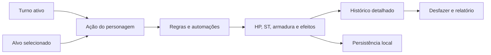
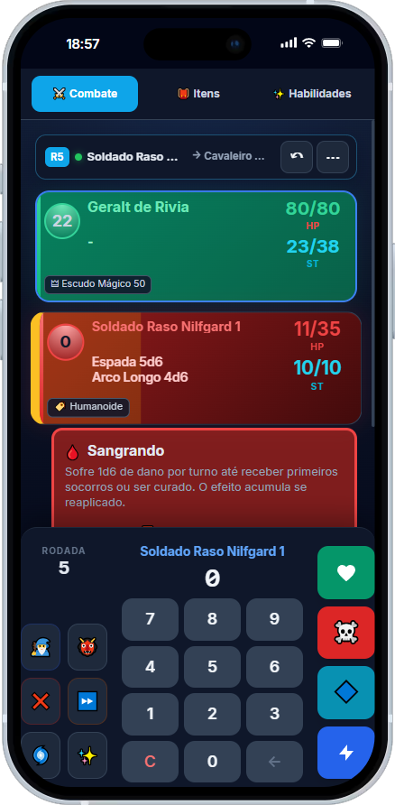
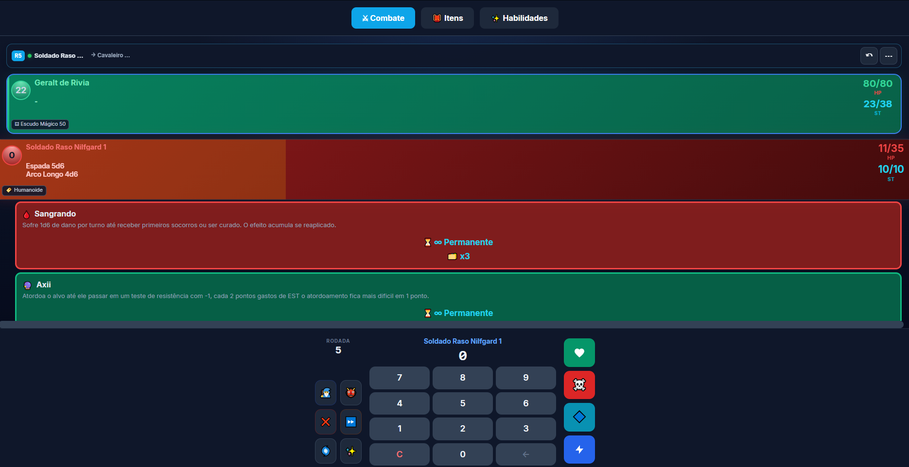

<div align="center">


# ⚔️ The Witcher Combat Tracker

### Gerencie combates complexos sem interromper o ritmo da mesa

Uma central de combate **mobile first**, instalável e preparada para funcionar offline. Controle turnos, dano localizado, armaduras, condições, magias, itens, fichas, histórico e automações inspiradas em **The Witcher TRPG** em uma única interface.

[](./manifest.json)


[**Abrir aplicação**](https://juanmeissner.github.io/The-Wticher-Combat-Tracker/) · [**Ver repositório**](https://github.com/juanmeissner/The-Wticher-Combat-Tracker) · [**Guia rápido**](#-guia-rápido-de-uso)

</div>

---

## Visão geral

O **The Witcher Combat Tracker** foi criado para reduzir cálculos repetitivos e manter todas as informações importantes visíveis durante uma sessão de RPG. A aplicação separa claramente duas responsabilidades:

- **personagem do turno ativo:** é quem está agindo e pagando custos de EST;
- **alvo selecionado:** é quem recebe dano, cura, condições, itens ou magias.

Essa separação permite executar ações rapidamente sem perder o contexto do combate. Cada alteração relevante pode alimentar o histórico, o sistema de desfazer, os relatórios e as fichas persistentes.

O equipamento também acompanha esse contexto: cada participante possui seu próprio inventário, suas próprias habilidades e sua própria configuração de Magia Expandida. Ao avançar o turno, as abas **Itens** e **Habilidades** mudam automaticamente para as coleções do novo personagem ativo.



## Prévia da interface

### 📱 Experiência mobile / iOS

<p align="center">
  
</p>

<p align="center"><sub>Interface mobile first com navegação compacta, cartões legíveis e pad integrado à área inferior do iOS.</sub></p>

### 🖥️ Experiência desktop

<p align="center">
  
</p>

<p align="center"><sub>Visão expandida para acompanhar vários participantes, condições e recursos sem perder os controles principais.</sub></p>

## Destaques do produto

| Sistema | O que entrega |
|---|---|
| ⚔️ Combate | Iniciativa, turnos, rodadas, alvos, HP, ST, armadura, dano localizado e testes de morte |
| 💥 Críticos | Margem, gravidade, 24 ferimentos, vacilos, defesas críticas, consequências avançadas, tratamento e histórico |
| 🧙 Fichas | Criação rápida ou completa, progressão, inventário, equipamentos e transferência individual entre dispositivos |
| 👹 Bestiário | Monstros predefinidos, busca, detalhes e painéis rápidos de ataques, habilidades e perícias |
| 🎁 Saque | Recompensas contextuais, rolagem de quantidades, distribuição de itens e divisão de Coroas |
| 🌀 Condições | Painel responsivo em grade, duração, stacks e dano recorrente automatizado |
| 🛏️ Cuidados | Alimentação, higiene, hospedagem, ciclos diários, recuperação e estados persistentes |
| ☣️ Toxicidade | Poções com valores próprios, limiares cumulativos, Tolerância, overdose e Mel Branco |
| ✨ Efeitos | Magias e itens ativos vinculados individualmente aos participantes |
| 🎒 Inventário | Itens individuais por personagem, troca pelo turno ativo, catálogo, quantidades, filtros e detalhes |
| ⚒️ Criação, alquimia e culinária | Receitas funcionais, ingredientes disponíveis/ausentes, lotes, testes e produção automática |
| 🛡️ Equipamentos | Armas, reservas, flechas/setas, cinco slots de proteção, escudo global, troca rápida e defesa persistente |
| 🐎 Montarias | Cavalos individuais, equipamento próprio, alforjes, Central de Carga, carroças, carruagens e dano independente |
| 📚 Habilidades | Magias individuais por personagem, Magia Expandida, custo de treino, ativação e exportação |
| 📜 Histórico | Linha do tempo por rodada, filtros, autoria, testes, cálculos, efeitos e golpes finais |
| ↶ Segurança | Confirmações, desfazer ações, encontros salvos e backup completo em JSON |
| 📲 PWA | Instalação, modo standalone sem zoom acidental, cache offline, atualização e reparo do aplicativo |

## Sistemas da aplicação

### ⚔️ Gerenciamento de combate

- criação de jogadores e monstros personalizados;
- inclusão de criaturas diretamente do bestiário;
- definição de nome, iniciativa, HP, ST, CA, ataque e raça/categoria;
- defesa adicional opcional para **cabeça, tronco, braços e pernas**, independente dos equipamentos;
- ordenação por iniciativa e avanço automático de turnos e rodadas;
- indicação visual do turno atual e do próximo participante;
- nome do personagem ativo sempre sincronizado no pad;
- seleção independente do alvo da ação;
- participantes eliminados agrupados abaixo de todos os participantes vivos;
- controle de sucessos, falhas, estabilização e morte para personagens em 0 HP;
- rolagem rápida de iniciativa dos monstros ao manter pressionado o botão correspondente;
- finalização segura do combate e geração de relatório pós-combate.

### 🎯 Dano localizado e armadura

O valor digitado no pad é tratado como dano base. A aplicação calcula toda a proteção disponível na região, reduz esse total do golpe e somente depois aplica os multiplicadores escolhidos.

```text
Defesa total da região = defesa adicional da ficha + armadura equipada + escudo físico
```

As três fontes são independentes. Equipar uma peça não altera os valores preenchidos na ficha; desequipá-la remove imediatamente apenas a contribuição daquela peça. A defesa adicional e o escudo permanecem ativos enquanto continuarem configurados.

| Região | Multiplicador |
|---|---:|
| Cabeça | ×3 |
| Tronco | ×1 |
| Braço | ×0,5 |
| Perna | ×0,5 |

Também estão disponíveis:

- dano cheio, dividido ou dobrado;
- dano crítico contextual, disponível somente depois de escolher a região atingida;
- dano que ignora armadura;
- dano direto à armadura equipada, à defesa adicional ou ao escudo;
- escolha exata da fonte atingida quando **Dano Armadura** encontra mais de uma proteção disponível;
- escudos físicos somados à defesa de cabeça, tronco, braços e pernas;
- soma automática das proteções antes de decidir se o dano alcança os PV;
- registro do dano base, defesa adicional, equipamento, escudo, total absorvido, multiplicadores e PV final;
- absorção por escudo mágico e PV temporários;
- identificação automática de golpes que derrotaram o alvo.

> **Exemplo:** um personagem com 2 de defesa adicional, armadura de tronco 5 e escudo 3 possui 10 de defesa total no tronco. Um ataque de 15 deixa 5 pontos de dano. Ao desequipar a armadura, a defesa do tronco passa imediatamente para 5, mantendo apenas a defesa adicional e o escudo.

### 💥 Críticos e ferimentos críticos

O crítico não acrescenta um controle permanente ao pad. Depois de informar o dano e escolher a região, a opção **Dano Crítico** abre um fluxo contextual:

1. dobra o dano base;
2. aplica o multiplicador da região;
3. ignora toda a armadura física;
4. identifica a gravidade pela margem que venceu a defesa;
5. permite sortear ou informar um ferimento válido para a região atingida;
6. soma o dano adicional do ferimento ao resultado localizado;
7. concede `+1 Adrenalina` ao personagem do turno.

| Margem | Gravidade | Dano adicional |
|---:|---|---:|
| 7–9 | Simples | +3 |
| 10–12 | Complicado | +5 |
| 13–14 | Difícil | +8 |
| 15 ou mais | Mortal | +10 |

Os 24 ferimentos cadastrados são filtrados por **cabeça, tronco, braço ou perna** e usam diretamente os atributos e perícias existentes no aplicativo — Constituição, Força, Destreza, Inteligência, Físico, Atletismo e Reflexo/Esquivas — sem depender das antigas abreviações CORPO, VEL, VON ou REF. Sangramento, Veneno, Atordoamento e morte imediata são aplicados quando a regra exigir; **Estômago Rasgado** causa 4 de dano ácido por turno e **Dano no Coração tratado** mantém 2 de Sangramento recorrente. Penalidades entram no assistente de testes, Fratura de Crânio eleva para ×4 novos danos na cabeça e limitações graves reduzem automaticamente EST, Movimento e Carga. Braços inutilizados bloqueiam armas de duas mãos; pernas torcidas, fraturadas ou amputadas aplicam reduções e frações de Movimento previstas pela regra. Lembretes de Sufocamento e testes periódicos de Atordoamento ou Morte aparecem no turno correto. Cada participante recebe um painel recolhido por padrão para acompanhar **Normal → Estabilizado → Tratado → Curado**, com consequências e mudanças registradas no histórico.

> **Exemplo:** 20 de dano crítico na cabeça vira `20 × 2 × 3 = 120`. Um ferimento Mortal acrescenta 10, totalizando **130 de dano com armadura ignorada**.

#### 🩺 Tratamento médico assistido

As mudanças de **Normal → Estabilizado** e **Estabilizado → Tratado** passam por um assistente de tratamento. O mestre escolhe o responsável, a perícia ou recurso utilizado, o ND, o modificador, a quantidade de sucessos necessária e, quando aplicável, o tempo estimado de recuperação. O sistema oferece **Primeiros Socorros**, **Mãos Curativas** para quem possui a habilidade e uma opção manual para itens, magias ou outros auxílios.

- usa rolagem manual ou automática conforme a preferência de testes;
- considera penalidades causadas pelos ferimentos do responsável;
- acumula e persiste sucessos quando o tratamento exigir mais de uma tentativa;
- mantém o ferimento no estado atual quando o teste falha;
- bloqueia estabilização ou tratamento quando a regra do ferimento não permite;
- registra paciente, responsável, método, cálculo, ND, margem, progresso e recuperação no histórico;
- concede Dado da Sorte e Adrenalina ao responsável em um `20 natural`, seguindo a regra geral de críticos.

#### 💢 Vacilos e críticos defensivos

Um `1 natural` em ataque, Bloqueio ou Esquiva abre a tabela contextual adequada. Um `20 natural` em Bloqueio ou Esquiva abre o crítico defensivo. O mestre pode rolar ou informar o `1d10`, revisar o resultado e só então aplicá-lo. O sistema cobre:

- vacilos de ataques corpo a corpo e à distância;
- vacilos de Bloqueio e Esquiva;
- críticos de Bloqueio e Esquiva;
- condições como Caído e Desequilibrado;
- munição destruída, desgaste e inutilização de armas;
- dano complementar, seleção do participante afetado e absorção por proteções temporárias;
- desarme real da arma ativa, que continua preservada no inventário;
- escolhas contextuais da Esquiva crítica, como **Desequilibrado ou perder a reação** e **Caído ou sofrer 1d6 de impacto**;
- consequências pendentes em um minicard recolhível, com ação **Resolver**.

Armas avariadas exibem seu desgaste no card de equipamentos e podem ser reparadas nos detalhes do item. Reposicionamentos, testes de Atordoamento, ataques imediatos e resultados que exigem escolher dano ou região permanecem como lembretes resolvíveis porque dependem do estado da mesa. Resultado, escolha, condições, dano, proteção, munição e arma afetada são registrados no histórico. Todo o fluxo permanece contextual e não adiciona novos botões permanentes ao pad.

### 🛡️ Escudo mágico e PV temporários

Os dois recursos possuem comportamentos diferentes:

- **Quen e Quen Ampliado** criam escudo mágico. O dano vai diretamente ao escudo, ignora armadura e o excesso do golpe é descartado;
- quando o escudo absorve todo o ataque, não é necessário escolher local do dano;
- **Lua Cheia, Bravura de Freya e outros bônus de PV temporários** podem coexistir e são somados;
- PV temporários continuam usando localização e armadura, pois representam vida adicional e não uma barreira mágica.

### 🌀 Condições e efeitos

O seletor de condições usa um painel central responsivo em grade no celular e no desktop. Os nomes permanecem visíveis e os botões são adequados para toque ou mouse.

Cada condição ou efeito pode conter:

- duração em rodadas ou permanência;
- stacks individuais;
- descrição completa;
- origem e alvo;
- atualização, aplicação e remoção registradas no histórico;
- identidade visual e ícone próprios.

**Sangramento**, **Em Chamas** e **Envenenado** causam 1d6 por stack no início do turno afetado. As três condições aceitam até 10 stacks, conforme suas regras cadastradas.

### 🛏️ Cuidados, descanso e necessidades

Com o pad zerado, o botão de Coração abre o fluxo contextual **Cuidados e descanso** sem adicionar controles permanentes à interface. O mestre escolhe os beneficiários, alimentação, banho, hospedagem, valores e pagadores; sem pagador selecionado, nenhuma Coroa é removida.

- cada confirmação representa um novo ciclo diário da campanha;
- dias sem alimentação, banho ou sono permanecem salvos individualmente;
- `Faminto`, `Falta de Higiene` e `Privação de Sono` acumulam pilhas e alteram testes de perícia;
- refeições, banhos e hospedagens recuperam HP e EST conforme a qualidade;
- `Bem Alimentado`, `Revigorado` e `Bem Descansado` concedem benefícios válidos por um ciclo;
- PV e EST temporários de fontes diferentes coexistem, e o EST temporário é consumido antes do normal;
- hospedagens simples usam testes assistidos de Físico e Intimidação, com Desconforto e risco de roubo;
- estado diário, última escolha, benefícios e histórico são preservados nas fichas salvas e restaurados ao voltar ao combate.
- alimentos e bebidas ficam disponíveis em **Itens → Usáveis**, com tipo, qualidade e quantidade de porções;
- os 11 alimentos preparados — de Pão Rústico e Sopa de Legumes a Estufado Real da Caça e Banquete de Toussaint — aplicam automaticamente Refeição Simples, Boa ou Sofisticada ao proprietário do inventário;
- o consumo direto de alimento recupera os recursos correspondentes, atende a necessidade diária, atualiza os efeitos e remove uma unidade do inventário;
- Água Potável, Cerveja de Mahakam e Vinho de Toussaint têm consumo e histórico próprios, mas não substituem uma refeição enquanto uma regra de hidratação ou álcool não for definida.
- um **responsável profissional** pode ser escolhido dentro do próprio fluxo, sem acrescentar botões ao pad;
- **Iniciado dos Deuses** e **Cantar por Moedas** abrem testes assistidos e, em caso de sucesso, reduzem somente os custos compatíveis;
- **Cuidado Prolongado** aumenta a recuperação de HP dos aliados após hospedagem, enquanto **Dormir Leve** neutraliza Desconfortável para o próprio responsável;
- **Balada do Sobrevivente**, **Ciclo de Abundância** e **Frutos de Freya** criam benefícios diários persistentes, visíveis em Efeitos Ativos e considerados nos testes correspondentes;
- o histórico registra responsável, teste, ND, cálculo, redução de Coroas e cada benefício profissional aplicado.

Categorias desmarcadas não aumentam contadores de ausência. Ao iniciar o ciclo seguinte, benefícios diários antigos expiram e somente os escolhidos novamente são renovados.

### ☣️ Toxicidade de poções

As poções possuem toxicidade própria de **25%, 50% ou 75%**. Ao consumir uma delas pela aba **Itens**, seu efeito ativo é aplicado — ou renovado — automaticamente no personagem dono daquele inventário, incluindo as automações específicas da poção. Em seguida, a toxicidade é somada e um indicador compacto aparece no cartão de combate somente enquanto houver toxicidade.

| Limiar | Processamento no turno |
|---:|---|
| 100% | Teste de Tolerância CD 14; uma falha causa 1d4 de dano |
| 125% | 1d4 automático e −2 em testes físicos |
| 150% | O dano passa a 1d6; Tolerância CD 16 contra Atordoamento |
| 175% | Mantém 1d6; Tolerância CD 18 contra Inconsciência |
| 200% | Mantém 1d6; Tolerância CD 18 contra Estado de Morte por overdose |

As consequências são cumulativas, mas o dano recorrente **não**: a aplicação usa somente o dado da faixa mais alta alcançada. No fim do processamento, o personagem reduz `Tolerância total + nível` pontos percentuais de toxicidade. Cada nível investido em **Toxicidade Controlada** eleva todos os limiares em 25 pontos percentuais. **Mel Branco** zera a toxicidade e remove os efeitos ativos de poções, preservando magias, condições e outros tipos de efeito.

Os testes usam a preferência de **Condições negativas** — rolagem automática por padrão ou resultado informado pelo mestre — e dano, testes, condições, redução natural e overdose ficam disponíveis nos detalhes do histórico.

### 🤖 Automações de regras

As automações preservam a decisão do mestre: magias e itens perguntam resultados por padrão, enquanto condições negativas usam rolagem automática. Esse comportamento pode ser alterado em **⋯ → Preferências**.

| Regra automatizada | Comportamento |
|---|---|
| Quen | Pergunta o EST gasto, debita do personagem do turno e cria 5 pontos de escudo por EST |
| Quen Ampliado | Debita o conjurador ativo e cria 10 pontos de escudo por EST |
| Yrden | Usa EST variável, calcula penalidade e controla duração |
| Axii | Pergunta o EST, calcula a penalidade do teste e aplica a condição vinculada ao alvo |
| Axii Marionete | Usa o EST gasto como custo e duração do controle |
| Cura Mágica | Calcula `3 + bônus de Inteligência + 1d6`, cura o alvo escolhido e registra a fórmula completa |
| Sangramento, Chamas e Veneno | Rola 1d6 por stack e aplica o dano no turno do alvo |
| Toxicidade | Processa limiares, um único dano recorrente, testes de Tolerância, penalidades e redução por turno |
| Toxicidade Controlada | Eleva todos os limiares em 25 pontos percentuais por nível investido |
| Mel Branco | Zera a toxicidade e remove apenas efeitos de poções |
| Pó de Coagulação | Impede que Sangramento produza efeito enquanto estiver ativo |
| Lua Cheia | Concede 10 + 1d20 PV temporários |
| Andorinha | Recupera vida por turno enquanto as condições do item forem atendidas |
| Coruja-do-mato | Recupera ST por turno |
| Filtro de Petri | Registra o bônus para o próximo sinal |
| Sangue Negro | Causa 1d6 ao vampiro que atacar o usuário protegido |
| Óleos | Aplicam o efeito diretamente pelo inventário e adicionam o bônus contra a categoria correta de criatura |
| Fissstech | Reduz pela metade o dano recebido enquanto estiver ativo |

Criaturas predefinidas recebem suas categorias automaticamente. Monstros vampíricos entram no combate com a condição **Vampiro**, permitindo que Sangue Negro funcione sem perguntas repetidas. Personagens e criaturas personalizadas também podem receber uma raça/categoria ao serem criados.

### 👤 Inventários e habilidades por personagem

O turno ativo funciona como contexto padrão das abas **Itens** e **Habilidades**:

- cada participante mantém seu próprio inventário, habilidades e valor de Magia Expandida;
- avançar o turno troca automaticamente as duas abas para o novo personagem ativo;
- um seletor permite consultar ou editar diretamente as coleções de qualquer participante sem alterar o turno;
- ao entrar novamente em uma dessas abas, o personagem do turno volta a ser selecionado por padrão;
- o painel de aplicação de efeitos mostra somente itens e habilidades realmente possuídos pelo personagem ativo;
- fichas salvas, encontros, desfazer, backups e restaurações preservam essas coleções individualmente;
- inventários antigos compartilhados são migrados com segurança para o participante ativo.

> **Exemplo:** Geralt pode carregar uma Espada de Prata de Bruxo e Quen, enquanto Yennefer mantém Clorofórmio e suas próprias magias. Alternar o turno alterna o conteúdo exibido sem misturar os dois personagens.

### 🎒 Inventário e itens

- separação entre **Usáveis**, **Equipamentos**, **Diversos** e **Criação**;
- filtros contextuais compactos tanto no inventário quanto no catálogo: comidas, bebidas, poções, arremessáveis, poções de Witcher e óleos em **Usáveis**; munições, famílias de armas, escudos, armaduras por região e **Equipamentos de Montaria** em **Equipamentos**; ingredientes culinários, itens de monstros, ervas, minérios, metais, materiais naturais e **Montarias** em **Diversos** — este último reúne cavalos, carroças e carruagens, com **Veículos** disponível como refinamento;
- seleção de filtro preservada separadamente por aba, com quantidade disponível e navegação horizontal responsiva no mobile;
- navegação entre **Combate**, **Itens** e **Habilidades** exclusivamente pelos botões superiores, evitando trocas acidentais de tela ao deslizar os filtros ou o inventário;
- cada card do catálogo abre primeiro um modal com descrição, peso, categoria, propriedades, efeitos e receita, evitando inclusões acidentais;
- aquisição com quantidade configurável, podendo ser gratuita ou marcada como compra;
- preço unitário sugerido pelo catálogo e editável pelo mestre antes da confirmação;
- compra atômica: valida o saldo, debita as Coroas e entrega todos os itens juntos; saldo insuficiente não altera o inventário;
- aquisições gratuitas e compras registradas no histórico com quantidade, preço, total e saldo restante;
- depois da aquisição, o catálogo permanece aberto para permitir consultar ou adicionar outros itens;
- busca por nome e filtro por tipo;
- alteração de quantidade pelos botões `+` e `−`;
- uso direto de consumíveis;
- aplicação ou renovação automática do efeito da poção no dono do inventário ao usar o consumível;
- aplicação ou renovação automática dos óleos de bruxo usados pelo inventário, com duração de 20 rodadas e bônus contra a categoria correspondente;
- seleção contextual de um ou vários alvos para adesivos, pós, bombas, drogas e outros itens de área;
- execução completa de **Solução Ácida**, **Fúria de Bredan**, **Fogo da Zerikânia** e **Bomba de Estilhaços**, com seleção múltipla, dano informado uma única vez e resolução individual de local para cada alvo;
- ablação da Solução Ácida em todas as armaduras equipadas e na arma ativa, além de dano fixo nas proteções atingidas por explosivos;
- testes de Tolerância automatizados ou informados para **Veneno Negro** e **Fúria de Bredan**, aplicando Envenenado ou Em Chamas somente nas falhas;
- **Pó Básico** capaz de neutralizar o resíduo ácido ou estabilizar Estômago Rasgado, interrompendo o dano ácido recorrente;
- **Sais Aromáticos** e **Lágrimas de Esposas** removendo, respectivamente, inconsciência/atordoamento e intoxicação, sem consumir o item quando o alvo não possuir um efeito válido;
- **Tumba de Adda**, **Tinta Invisível** e **Amigo do Envenenador** tratados como usos narrativos, com confirmação, lembrete de regra e registro no histórico;
- **Nevasca** rolando `1d6` no consumo e somando o resultado a sentidos/Percepção, Reflexo/Esquiva, Bloqueio, Atletismo, Acrobacias, Lançar Feitiços e perícias de armas;
- **Gato** anulando hipnose e Enfeitiçado, removendo penalidades visuais de escuridão e oferecendo `+5` contextual contra ilusões no assistente de testes;
- **Baleia Assassina** calculando respiração submersa em `×1,5` e anulando penalidades visuais subaquáticas nos testes contextuais;
- **Bosque de Maribor** concedendo um dado adicional sempre que o personagem ganhar Adrenalina, inclusive em críticos, Sobrecarga Arcana e tratamento;
- **Trovoada** aplicando `+2` automaticamente em ataques corpo a corpo/à distância, Bloqueio e Reflexo/Esquiva;
- Fisstech com teste de Tolerância ND 20 em todo uso, bônus da perícia somado automaticamente, Vício acumulativo em falhas e Abstinência iniciada 10 turnos após o efeito terminar;
- redução final de dano pelo Fisstech registrada com o valor exato suprimido;
- Bafo de Dragão e Inflamador processados antes do local de acerto, na ordem `dano base +20 → ×2 → local/tipo → Fisstech`;
- Cura Potencializada aplicada apenas a curas reais de HP, sem aumentar PV temporários ou Escudo Mágico;
- toxicidade exibida nos detalhes de cada poção e aplicada ao consumir;
- detalhes acessíveis por botão no desktop, duplo clique ou toque prolongado;
- efeitos de itens aplicáveis a qualquer participante selecionado;
- feedback visual para inclusão, remoção e uso;
- transferência de itens, materiais, moedas e equipamentos excedentes entre personagens;
- proteção contra consumo ou transferência acidental da última unidade equipada;
- catálogo validado para impedir identificadores duplicados entre armas, equipamentos e materiais;
- sincronização individual com o participante e sua ficha vinculada.

### ⚒️ Criação, alquimia e culinária

A categoria **Criação** transforma as receitas do catálogo em uma oficina vinculada ao inventário do personagem consultado:

- lista todas as receitas conhecidas e permite busca por produto;
- ao tocar no contador, abre um filtro compacto por **Armas**, **Armaduras**, **Alquimia**, **Culinária** ou **Materiais**;
- filtro **Posso criar** mostra somente receitas com ingredientes suficientes;
- cada cartão informa os componentes livres, os ausentes e o rendimento de cada lote;
- escolha da quantidade de lotes antes de confirmar a produção;
- consumo automático dos ingredientes e inclusão do produto no inventário correto;
- rendimentos especiais preservados, como 10 flechas, 10 setas ou 6 unidades de Pó de Prata por lote;
- teste manual ou automático quando a receita possuir ND/CD;
- modo automático configurável em `⋯ → Preferências → Rolagens → Criação e alquimia`, usando `1d10 + bônus`;
- sucesso e falha registrados no histórico com produto, quantidade, ingredientes e resultado do teste;
- ingredientes preservados em caso de falha, evitando perdas não previstas por uma regra cadastrada;
- itens equipados ficam reservados e não são consumidos como matéria-prima.

A categoria **Culinária** reutiliza a mesma oficina sem acrescentar botões permanentes. São 16 receitas culinárias, incluindo Ração de Viagem, Pão Rústico, Sopa de Legumes, Coelho Assado com Ervas, Ensopado de Veado, Porco Assado com Alho, Omelete com Cogumelos, Torta de Carne, Estufado Real da Caça, Banquete de Toussaint, bebidas e o processamento de Farinha e Manteiga. Os 23 ingredientes culinários — incluindo Sal, carnes de coelho, veado e porco, vegetais e laticínios — podem ser guardados ou transferidos entre personagens. Assim que uma comida é produzida, ela já pode ser consumida pelo inventário para aplicar a qualidade correspondente no sistema de Cuidados e Descanso.

O catálogo foi normalizado com todos os ingredientes nomeados pelas receitas. Fissstech permanece indisponível porque sua receita original contém apenas ingredientes desconhecidos (`?`). A auditoria completa está em [`docs/crafting-catalog-audit.md`](docs/crafting-catalog-audit.md).

### 🛡️ Equipamentos realmente equipáveis

Cada participante possui um conjunto de equipamentos próprio e persistente:

- uma **arma ativa** e até **duas armas reservas**;
- troca rápida da arma ativa pelo botão `🔄` no cartão do participante;
- duas posições de munição por personagem, com uma munição ativa e uma segunda opção para troca rápida;
- compatibilidade automática: arcos usam flechas, enquanto bestas usam setas/virotes;
- quantidade e modificador da munição visíveis junto da arma de disparo ativa;
- consumo de uma unidade pelo botão `−1`, sem abrir o inventário;
- troca automática para a segunda munição compatível quando o estoque ativo chega a zero;
- armaduras equipadas separadamente em **cabeça, tronco, braços e pernas**;
- um escudo físico que acrescenta sua defesa às quatro regiões;
- slots explícitos `head`, `body`, `arms`, `legs` e `shield`, impedindo que calças ou braceiras substituam a proteção de tronco;
- defesa total formada pela soma da defesa adicional da ficha, da peça regional e do escudo;
- equipar ou desequipar uma peça atualiza imediatamente a defesa efetiva sem modificar a defesa adicional;
- defesa atual de cada peça preservada quando ela é danificada, guardada, salva em ficha ou restaurada em um encontro;
- reparo completo de armaduras e escudos diretamente nos detalhes do item, restaurando a defesa máxima e registrando a ação no histórico;
- identificação persistente de **arma ativa**, **reserva**, **peça equipada** e respectivo slot nos cartões do inventário;
- estado equipado preservado ao trocar de aba, mudar o personagem consultado ou avançar o turno;
- armas de duas mãos incompatíveis com um escudo ativo — o aplicativo orienta a guardar o escudo antes da troca;
- painel próprio recolhível abaixo do personagem, mantendo visível somente a arma ativa e um resumo compacto das proteções;
- histórico e ação de desfazer para equipar, desequipar, trocar armas ou munições, consumir disparos e danificar proteções.

A rolagem de dano continua **manual por padrão**, respeitando os dados físicos da mesa. Em `⋯ → Preferências → Rolagens`, a opção **Armas e ataques** pode ser alterada para automática; nesse modo, tocar em `🎲` rola a expressão da arma e coloca o total no pad, sem causar dano imediatamente.

> **Exemplo:** uma defesa adicional de tronco 2, uma armadura equipada com 5 e um escudo com 3 fornecem 10 de proteção. Se **Dano Armadura** for escolhido, o mestre decide se o desgaste será aplicado à defesa adicional, à armadura ou ao escudo.

### 🐎 Montarias, veículos e carga

Cavalos, carroças e carruagens são adicionados pelo catálogo de itens e permanecem vinculados ao inventário do personagem. Cada unidade é tratada como um recurso individual: dois Cavalos de Guerra podem ter nomes, HP, equipamentos e cargas diferentes, mesmo que o inventário resuma o item como `x2`.

- quatro tipos de cavalo com HP e Movimento próprios;
- sela, alforjes, barda e ferraduras equipados em posições independentes;
- nenhuma montaria possui capacidade de carga sem alforjes;
- alforjes pequenos, grandes e reforçados concedem 30, 60 ou 90 de capacidade;
- Ferraduras de Viagem, de Corrida e Élficas concedem respectivamente `+1`, `+2` ou `+3` de Movimento;
- os detalhes de cavalos e acessórios mostram HP, Movimento, defesa, capacidade concedida, peso e demais modificadores relevantes;
- carroças e carruagens exibem nos detalhes a capacidade total, quantidade de cavalos exigida, HP e penalidade de Movimento;
- **Central de Carga** com origem, destino, item e quantidade selecionáveis, permitindo transferências diretas entre personagem, montarias e veículos sem armazenamento intermediário;
- ícones locais, emojis e imagens externas são renderizados corretamente na carga; seletores compactos usam um ícone semântico no lugar de exibir o endereço da imagem;
- ações rápidas preservadas em cada card, com peso e limite conferidos antes de qualquer movimentação;
- carga de cada montaria separa o peso dos equipamentos próprios do conteúdo guardado nos alforjes;
- carga de carroças e carruagens é calculada pelo conteúdo de seus inventários independentes;
- transportes com dados legados acima da capacidade exibem **Sobrecarga** e perdem Movimento conforme o excesso;
- carroças com inventário próprio exigem exatamente um cavalo atrelado;
- carruagens com inventário próprio exigem exatamente dois cavalos;
- cavalos já atrelados ou derrotados ficam indisponíveis para outro veículo;
- veículos podem ser desatrelados pelo mesmo painel, liberando imediatamente todos os cavalos vinculados;
- uma montaria ativa pode ser montada ou desmontada sem acrescentar botões ao pad;
- enquanto montado, o Movimento efetivo do cavalo substitui o Movimento do personagem e aparece no card principal;
- o card **MONTARIA** começa recolhido, usa o mesmo espaçamento visual dos demais painéis e mostra HP, Movimento, carga e proteção sem poluir o combate;
- ao causar dano em um personagem montado, o aplicativo pergunta se o alvo é o cavaleiro ou a montaria;
- dano na montaria é absorvido primeiro pela barda, reduz o HP próprio e desmonta automaticamente o personagem quando ela é derrotada;
- estados de saúde **Saudável**, **Ferida**, **Gravemente ferida** e **Derrotada** são calculados pelo HP e registrados sempre que mudam;
- condições próprias de montaria — **Assustada**, **Atordoada**, **Caída** e **Em fuga** — afetam Movimento e disponibilidade para montar;
- uma montaria Caída ou derrotada derruba o cavaleiro, aplica **Caído** ao personagem e registra o incidente no histórico;
- a ação contextual **Fuga** fica dentro do painel recolhível da montaria e impede novo uso até a condição ser removida;
- montarias com carga, equipamento ou vínculo ativo não podem ser removidas acidentalmente do inventário;
- todo o estado é preservado na ficha vinculada, nos encontros e na sessão de combate.

Para usar, adicione um cavalo em **Itens → Etc. → Montarias**, selecione-o e toque em **Gerenciar**. No mesmo painel é possível nomear o animal, equipar acessórios, armazenar itens e escolher **Montar**. Veículos ficam em **Itens → Etc. → Veículos** e exibem os cavalos disponíveis para o pareamento exigido.

### ✨ Habilidades, sinais e magias

- catálogo com busca e filtro por tipo ou elemento cadastrado;
- detalhes de profissão, categoria, duração, defesa, dano, consumo, alcance e ação;
- adição, remoção, ativação e desativação;
- catálogo e detalhes permanecem abertos após adicionar uma habilidade, com confirmação imediata por aviso visual;
- cálculo do custo total de treino;
- modificador de **Magia Expandida** persistente;
- card compacto de **Magias** nas fichas completas, exibindo somente o repertório conhecido pelo personagem;
- cálculo não destrutivo da magia efetiva: custo original, reduções, modificadores profissionais e opções de conjuração;
- botão **Conjurar** com bloqueio por EST insuficiente, consumo da Fonte Rúnica antes do EST nos Sinais e registro detalhado no histórico;
- **Sobrecarga Arcana** opcional durante a conjuração, com escolha válida de dano, alcance ou duração, teste CD 16 e consequências automáticas de sucesso ou falha;
- **Cura Mágica** automatizada pela fórmula `3 + bônus de Inteligência + 1d6`, com dado físico informado por padrão ou rolagem automática pela preferência de magias;
- escolha do beneficiário, limitação pelo HP máximo e registro de cura solicitada, cura efetiva, fórmula e PV antes/depois;
- identificação contextual das magias ofensivas, com rolagem manual ou automática da fórmula de dano;
- seleção única para ataques direcionados e seleção por caixas para cones, raios, esferas e outras áreas;
- sequência de dano por alvo usando o fluxo normal de localização, tipo, armadura, crítico, Escudo Mágico e confirmação;
- reconhecimento automático de dano de Fogo nas conjurações para acionar Bafo de Dragão e Inflamador sem perguntas desnecessárias;
- efeitos aplicáveis no combate com indicação de **conjurador → alvo**;
- exportação das habilidades para uma planilha `.xlsx` no desktop;
- sincronização individual com o participante e sua ficha vinculada.

### 🧙 Fichas persistentes

Em **⋯ → Fichas → Nova ficha**, é possível escolher entre criação rápida, **criação completa em nove etapas** ou um **modelo pronto**. A ficha completa oferece:

- raça, profissão, especialização ou escola de bruxo;
- nível configurável e orçamentos progressivos de atributo, perícia e treino;
- seis atributos com valor base 10 e bônus derivado a cada dois pontos;
- distribuição de atributos otimizada para celular, com nomes e cálculos completos, controles separados e adaptação automática para uma coluna em telas estreitas;
- 53 perícias gerais e 280 habilidades profissionais com descrições completas;
- cards mobile de perícias e habilidades profissionais com texto e controles em áreas separadas, impedindo descrições comprimidas;
- posição da rolagem preservada ao aumentar ou remover níveis profissionais, perícias ou magias aprendidas;
- pontos compartilhados entre perícias gerais e profissionais, com limite de investimento validado;
- aprendizado de magias usando o custo oficial `unlockCost` e pontos de treino;
- permissões automáticas para Mago, Druida, Sacerdote/Clérigo, Ritual e Hex;
- concessão gratuita dos nove sinais e habilidades oficiais para personagens Witcher;
- busca e filtros na etapa de magias, além de resumo dos gastos na revisão;
- etapa exclusiva de valores derivados, com explicação dos cálculos de HP, EST, Carga e Movimento;
- Fonte Mágica do Lobo e Sobrecarga Arcana integradas ao EST máximo;
- Fonte Rúnica do Grifo mantida como uma reserva própria e visível no combate, priorizada no custo dos Sinais e regenerada junto do EST;
- rascunho persistente e opções para salvar, salvar e adicionar ao combate ou usar somente na sessão.
- edição completa pelo mesmo assistente: ao tocar em **Editar** numa ficha completa, os nove passos reabrem preenchidos desde o início para alterar nível, atributos, perícias e magias sem perder inventário, equipamentos, ferimentos ou recursos atuais.

Cada ficha salva também pode ser transferida individualmente entre dispositivos:

1. abra **⋯ → Fichas** e toque em **⇩ Exportar** no personagem desejado;
2. envie o arquivo `.json` gerado para o jogador ou mestre;
3. no outro dispositivo, abra **⋯ → Fichas → Nova ficha → Importar ficha** e selecione o arquivo;
4. revise o nome e o nível exibidos e confirme a importação.

A transferência preserva a ficha completa, recursos atuais, progressão, magias, inventário, equipamentos, montarias e demais dados vinculados. O arquivo é validado e atualizado para as regras atuais durante a leitura. A ficha recebida ganha uma nova identificação e nunca sobrescreve uma ficha existente; nomes repetidos recebem automaticamente o sufixo **(Importada)**.

Os seis modelos prontos aceleram a preparação sem bloquear nenhuma escolha:

- Bruxo da Escola do Lobo;
- Mago Humano;
- Guerreiro Vanguarda;
- Assassino Profissional;
- Clérigo de Melitele;
- Arqueiro Humano.

Ao escolher um modelo, o assistente abre no primeiro passo com uma construção de nível 1 já válida. Nome, raça, caminho, pontos, perícias e magias podem ser revisados livremente antes do salvamento. Cada uso cria um rascunho independente e não adiciona nada automaticamente às fichas ou ao combate.

As fichas rápidas e completas continuam reutilizáveis e podem conter:

- nome, HP máximo, ST máximo, CA e Movimento;
- HP e ST atuais preservados entre combates;
- raça ou categoria da criatura;
- ataque e dano;
- defesa adicional opcional da cabeça, tronco, braços e pernas;
- inventário individual;
- habilidades individuais;
- arma ativa, reservas, armaduras e escudo equipados, incluindo a defesa restante de cada peça.

Nas fichas completas, os valores máximos são recalculados a partir da construção do personagem:

- **HP:** `(bônus de Constituição + Físico total) × nível + (10 + Constituição base)`, em que Constituição base começa em 10 e inclui os pontos investidos, sem somar bônus raciais ou temporários novamente;
- **EST:** usa a fórmula correspondente a Witcher, Mago, Clérigo/Druida ou reserva física;
- **Carga:** `Força total ÷ 2 + Físico total + bônus de Força`, incluindo `+25` para Anões;
- **Movimento:** `(Atletismo total × 2) + 4 − peso considerado + Físico total + bônus de Força`, limitado entre 5 e 15 antes das consequências de ferimentos críticos;
- **Peso considerado:** por padrão soma armaduras, escudo, arma ativa, duas armas reservas e as pilhas de munição equipadas. Em `⋯ → Preferências → Peso e capacidade de carga`, pode ser alterado para considerar todo o inventário pessoal.

Todos os itens do catálogo possuem peso unitário. Valores oficiais são preservados e itens ainda sem peso específico recebem uma estimativa consistente, identificada internamente para facilitar futuras revisões. Flechas, setas, poções e pequenos consumíveis usam peso leve de `0,1` por unidade; ferro, aço, prata e minérios usam ao menos `1`. Itens personalizados também solicitam peso durante a criação.

Quando o peso considerado ultrapassa a Capacidade de Carga, o aplicativo aplica automaticamente **🏋️ Carregando Peso**. A condição mostra carga, limite, excesso e Movimento atual dentro de **EFEITOS ATIVOS**, sem ocupar a tela quando o personagem está dentro do limite. No modo padrão, desequipar peso suficiente remove a condição; no modo de inventário completo, também é possível transferir itens para alforjes, carroças ou carruagens. Esses itens deixam de contar imediatamente na carga pessoal, sem contagem duplicada. O Movimento total também fica sempre visível de forma compacta no card principal de jogadores e inimigos; criaturas predefinidas preservam as velocidades terrestre e de voo registradas no bestiário.

Quando um novo cálculo aumenta HP ou EST máximo, o recurso atual é preservado em vez de curar ou restaurar o personagem automaticamente. Se o novo máximo ficar abaixo do atual, o valor é limitado ao novo teto.

Uma ficha pode ser ativada para consultar seu inventário e suas habilidades ou adicionada diretamente ao combate. A lista de fichas resume caminho, nível, versão das regras, HP, EST, Fonte Rúnica, movimento, carga e pontos distribuídos sem exigir a abertura do editor. Alterações feitas durante a sessão são sincronizadas para reutilização posterior, sem substituir as coleções dos outros participantes.

### 🎲 Perícias e testes durante o combate

Os jogadores recebem um painel compacto de **Recursos** abaixo do card principal. Ele começa recolhido, mostra `🎲 Dado da Sorte` e `⚡ Adrenalina` no resumo e oferece controles manuais `−` e `+` ao ser expandido. Cada ajuste é limitado a zero, persiste na ficha vinculada e fica registrado no histórico. O painel também está disponível para fichas rápidas.

Qualquer jogador ou inimigo com condições, magias ou itens ativos recebe também o painel **EFEITOS ATIVOS**. Ele informa a quantidade no cabeçalho, começa recolhido e pode ser aberto independentemente dos demais painéis. Ao expandir, preserva os cards completos, duração, stacks, edição e remoção de cada efeito; recolher o painel não pausa suas automações nem a contagem de rodadas.

Personagens criados pela ficha completa recebem outros três painéis independentes abaixo do card principal, todos recolhidos por padrão:

- **Perícias:** mostra somente totais diferentes de zero, com nome, atributo vinculado e valor pronto para uso;
- **Habilidades profissionais:** mostra apenas habilidades investidas, mantendo nível e descrição completa disponíveis durante a sessão.
- **Magias:** lista apenas as magias conhecidas, mostra o custo efetivo daquele personagem e permite expandir detalhes ou conjurar diretamente no turno.
- As 280 habilidades profissionais são classificadas em automáticas, assistidas, lembretes e referências para implementação segura em lotes.
- Habilidades cujos bônus e recursos já são aplicados pelo sistema recebem um selo compacto `AUTOMÁTICO`.
- Habilidades assistidas oferecem **🎲 Realizar teste** no próprio card, calculando `1d20 + nível profissional + modificador` contra dificuldade ou oposição.
- O histórico mantém dado, nível, modificador, resultado, margem, desfecho e a descrição integral da regra consultada.
- Habilidades condicionais exibem etiquetas discretas como **PV baixo**, **Ao sofrer dano**, **Poção/Toxicidade** e **Durante o turno**, destacadas somente quando o contexto puder ser detectado.
- Regras narrativas ou dependentes de decisões externas recebem o selo `REFERÊNCIA` e continuam disponíveis integralmente para consulta.

Ao tocar em uma perícia, o aplicativo abre um assistente compacto que:

1. mostra a composição do total entre investimento, atributo, raça, profissão, equipamento e ajustes;
2. aceita uma dificuldade definida pelo mestre ou o resultado do oponente;
3. soma `1d20 + total da perícia + modificador do teste`;
4. usa o d20 físico informado manualmente por padrão;
5. pode rolar o d20 automaticamente quando **⋯ → Preferências → Testes de perícia** estiver em modo automático;
6. informa sucesso, falha, margem e resultado final;
7. registra todo o cálculo no histórico com um filtro próprio de **Teste**.

Um **20 natural** recebe a classificação **Crítico**, concede `+1 Dado da Sorte` e, durante o combate, `+1 Adrenalina`. Esses recursos ficam persistidos na progressão do personagem e aparecem no painel próprio **RECURSOS**, onde também podem ser corrigidos manualmente. Quando um teste bem-sucedido de ataque corpo a corpo ou à distância obtém `20 natural`, o aplicativo prepara automaticamente o próximo dano daquele personagem como crítico, transporta a margem contra a defesa e reaproveita a Adrenalina já concedida. Depois de informar o dano e escolher a região, o fluxo crítico abre automaticamente sem conceder a recompensa duas vezes. Bloqueios e Esquivas com `20 natural` continuam abrindo suas próprias tabelas defensivas de `1d10`.

### 👹 Bestiário e biblioteca personalizada

O bestiário oferece busca, ficha detalhada e adição rápida de monstros predefinidos. Durante o combate, cada criatura pode apresentar três painéis independentes abaixo do cartão principal:

- **Ataques:** mostra dano, efeitos associados e permite consultar ou rolar a expressão cadastrada;
- **Habilidades:** exibe o nome e a descrição completa de cada característica especial;
- **Perícias:** organiza os testes e seus respectivos bônus em uma grade compacta.

Os painéis de **Habilidades** e **Perícias** começam recolhidos para não poluir a tela e podem ser abertos separadamente quando a informação for necessária. Seus dados são copiados para o participante e preservados em encontros e backups. Os ataques continuam usando a mesma preferência de rolagem das armas e permanecem exclusivos dos monstros.

#### 🎁 Saque e recompensas

Quando um monstro predefinido é derrotado, o card eliminado recebe a ação contextual **Coletar saque**. O controle não aparece durante o combate normal e não ocupa espaço nos participantes vivos.

- interpreta quantidades fixas, dados como `1d10` e divisões como `1d6/2`, arredondadas para cima;
- resolve chances percentuais, como um saque com `5%` de possibilidade;
- mantém a primeira rolagem salva no monstro, mesmo ao fechar e reabrir o modal;
- destaca itens que exigem um teste `ND/CD` e deixa a confirmação do sucesso com o mestre;
- permite escolher individualmente quem recebe cada item encontrado;
- permite corrigir a quantidade de cada item e o total de Coroas antes de concluir a coleta;
- divide as Coroas igualmente entre os personagens marcados, sem entregar valores quando nenhum destinatário for selecionado;
- adiciona materiais ainda não cadastrados como itens genéricos transferíveis no inventário;
- impede que o mesmo monstro seja saqueado duas vezes;
- preserva toda a distribuição em encontros, backups, histórico e desfazer;
- inclui monstros saqueados, destinatários, itens e Coroas no relatório pós-combate.

Para conteúdo próprio, **⋯ → Biblioteca** permite criar, editar e excluir:

- itens personalizados, incluindo armas, armaduras, escudos, dano, defesa, quantidade de mãos e slot corporal;
- habilidades personalizadas;
- monstros personalizados com vários ataques, informados um por linha.

O conteúdo original permanece intacto e a biblioteca pessoal é mantida somente no dispositivo do usuário.

### 📜 Histórico inteligente

O histórico funciona como uma linha do tempo auditável do combate:

- organização por rodada;
- filtros por dano, cura, efeito, condição, equipamento, saque, teste e turno;
- filtro por participante;
- identificação de autor e alvo, como `Geralt → Grifo`;
- nomes, ícones e dano específico para Sangramento, Chamas e Veneno;
- registro de local atingido, rolagem, armadura, escudos, PV temporários e EST;
- detalhes de efeitos aplicados, atualizados, removidos ou expirados;
- testes de perícia com dado natural, bônus total, modificador, dificuldade ou oposição, margem, resultado e recompensas de crítico;
- registro próprio para criação, falha de fabricação, transferência e distribuição de saque;
- substituição de “dano” por **“derrotou”** quando a ação elimina o alvo;
- cartões compactos no mobile e detalhes expandidos sob demanda.

### 💾 Sessão, segurança e manutenção

O menu **⋯** concentra as ferramentas administrativas:

- `↶` desfaz ações recentes;
- salva e carrega encontros completos;
- exporta e restaura backup em JSON;
- exporta e importa fichas individuais em JSON sem substituir personagens existentes;
- gera relatório pós-combate com rodadas, participantes, derrotas, dano, cura, itens e Coroas distribuídas;
- configura contraste, animações e modos de rolagem;
- instala ou atualiza a PWA;
- repara o cache sem apagar os dados do usuário;
- restaura preferências;
- permite apagar todos os dados com dupla confirmação.

## 🎮 Guia rápido de uso

### 1. Prepare os participantes

1. Abra **⚔️ Combate**.
2. Toque em `🧙‍♂️` para criar um jogador ou em `👹` para criar/escolher um monstro.
3. Se preferir um personagem reutilizável, abra `⋯ → Fichas → Nova ficha`.
4. Escolha **⚡ Criação rápida**, **📜 Criação completa**, **🧭 Modelo pronto** ou **⇧ Importar ficha**.
5. Nos modelos prontos, selecione a função desejada, revise a construção desde o primeiro passo e personalize o nome.
6. Conclua com **Salvar ficha**, **Salvar e adicionar ao combate** ou **Somente combate**.

### 2. Entenda turno e alvo

- o nome acima do teclado numérico indica **quem está no turno**;
- o cartão destacado indica **quem está selecionado como alvo**;
- use `⏩` para avançar ao próximo participante;
- magias automatizadas com custo variável descontam EST do personagem do turno, mas afetam o alvo selecionado.

### 3. Prepare os itens e as habilidades do personagem

1. Verifique o nome do personagem indicado como turno ativo.
2. Abra **🎒 Itens** e adicione somente os objetos carregados por ele.
3. Selecione uma arma ou proteção e use **Equipar**. A primeira arma será ativa; as duas seguintes ficarão nas reservas. Cabeça, tronco, braços, pernas e escudo podem ser equipados simultaneamente.
4. Para um arco ou uma besta, equipe até duas munições. O aplicativo separa flechas de arco e setas de besta automaticamente.
5. No painel **EQUIPAMENTOS**, use `🔄` para trocar a munição e `−1` depois de cada disparo. Ao esgotar, a segunda munição compatível assume.
6. Abra **✨ Habilidades** e adicione seus sinais, magias ou técnicas.
7. Use o seletor no alto da aba para consultar outro participante sem avançar o combate.
8. Ao usar `⏩`, as duas abas passarão automaticamente para as coleções do próximo personagem.
9. Para fabricar algo, abra **🎒 Itens → Criação** e consulte os componentes livres no inventário.
10. Use **Posso criar** para esconder receitas ainda incompletas, escolha **Criar** e informe o número de lotes.
11. Para reunir materiais, selecione o item e use **🔄 Transferir item**; escolha o destinatário e a quantidade.
12. Ao usar uma poção, acompanhe `☣ TOX` no cartão do personagem; os limiares serão resolvidos automaticamente quando o turno dele começar. Use **Mel Branco** para limpar toxicidade e efeitos de poções.
13. Para bombas, Solução Ácida ou Fúria de Bredan, marque todos os atingidos, informe o total dos dados e confirme. O aplicativo danificará as proteções, resolverá condições e pedirá o local do dano de cada alvo em sequência.
14. Para Veneno Negro, informe apenas o resultado natural do `1d20`: o bônus total de Tolerância e o ND 18 são calculados pelo aplicativo. Em modo automático, o dado também é rolado pelo sistema.
15. Com Gato ou Baleia Assassina ativos, abra um teste compatível e marque o contexto de ilusão, escuridão ou visão subaquática somente quando ele realmente fizer parte da cena.

No combate, abra ou recolha **EQUIPAMENTOS** abaixo do personagem. Use `🔄` para alternar a arma ativa e `🎲` para consultar ou rolar seu dano, conforme a preferência escolhida.

Para monstros predefinidos, abra os painéis **ATAQUES**, **HABILIDADES** ou **PERÍCIAS** abaixo da criatura. Habilidades e perícias permanecem recolhidas por padrão e não exigem abrir novamente a ficha completa do bestiário.

Depois de derrotar uma criatura predefinida, expanda **ELIMINADOS** e toque em **🎁 Coletar saque**. Confira as quantidades roladas, ajuste quanto de cada item e quantas Coroas serão coletados, marque os testes ND bem-sucedidos, escolha o destinatário de cada item e selecione quem participará da divisão das Coroas. Se ninguém for marcado para receber as Coroas, elas não serão entregues. A coleta fica salva e será levada ao relatório pós-combate.

Para jogadores de ficha completa, abra **PERÍCIAS** abaixo do personagem e toque na perícia desejada. Informe a dificuldade ou o resultado do oponente, o d20 rolado na mesa e qualquer modificador temporário. As habilidades de profissão ficam no painel separado **HABILIDADES PROFISSIONAIS**.

Para consultar ou corrigir recursos, abra **RECURSOS** abaixo do jogador. Use `−` ou `+` em **Dado da Sorte** e **Adrenalina**; o novo valor é salvo na ficha e a mudança aparece no histórico da sessão.

Quando houver condições, magias ou itens aplicados, abra **EFEITOS ATIVOS** abaixo do participante para consultar ou editar seus cards. O cabeçalho permanece compacto quando recolhido e mostra quantos efeitos continuam em execução.

O indicador `👣 MOV` no card principal mostra o Movimento total atual. Em fichas completas, equipar, desequipar, consumir ou transferir itens recalcula imediatamente peso, capacidade e Movimento conforme a preferência da campanha. Se surgir **Carregando Peso**, abra **EFEITOS ATIVOS** para conferir exatamente quanto o limite foi ultrapassado.

Abra **MAGIAS** para consultar o repertório daquele personagem. Expanda `⌄` para ler a regra completa ou use **Conjurar**: escolha o alvo, informe o EST base quando a magia for variável e revise o custo final. Magia Expandida é calculada sem alterar o catálogo original. Se o personagem possuir Sobrecarga Arcana, a decisão e o teste aparecem dentro desse mesmo fluxo; um `20 natural` também concede Dado da Sorte e Adrenalina conforme as regras de testes em combate.

Ao conjurar **Cura Mágica**, selecione o beneficiário e informe o resultado do `1d6` físico. Se a preferência de magias estiver em modo automático, o aplicativo rola esse dado, calcula `3 + bônus de Inteligência + 1d6`, limita a recuperação ao HP máximo e registra todo o cálculo.

Se o teste de combate resultar em `1 natural`, ou em `20 natural` ao Bloquear/Esquivar, conclua a tabela contextual de `1d10`. Revise o participante afetado, a escolha oferecida e os dados complementares antes de aplicar; lembretes que dependem da decisão do mestre ficam no painel **CONSEQUÊNCIAS** do participante. Em um ataque bem-sucedido com `20 natural`, selecione o alvo, informe o dano pelo pad e escolha a região: a margem já calculada será usada automaticamente no fluxo de ferimento crítico.

Quando uma habilidade profissional possuir resolução assistida, use **🎲 Realizar teste** no próprio card. O aplicativo calcula o confronto e deixa decisões narrativas ou efeitos condicionais sob controle do mestre.

### 4. Aplique dano

1. Selecione o cartão do alvo.
2. Digite o dano base no teclado numérico.
3. Toque em `☠️`.
4. Escolha cabeça, tronco, braço ou perna.
5. Escolha o tipo de dano.
6. Para um crítico, escolha **💥 Dano Crítico**, informe a margem e sorteie ou selecione o ferimento.
7. Confira a confirmação e o registro detalhado no histórico.

### 5. Cure ou gerencie recursos

1. Selecione o participante.
2. Digite o valor.
3. Use `❤️` para curar, `🔷` para gastar/recuperar ST ou `⚡` para definir iniciativa.
4. Em 0 HP, os botões de cura e dano também controlam sucessos e falhas de morte.

### 6. Aplique condições, magias e itens ativos

1. Selecione o alvo.
2. Use `🌀` para condições ou `✨` para efeitos de habilidades e itens.
3. Escolha o efeito desejado.
4. Quando necessário, informe duração, stacks, EST ou resultado de dados.
5. Avance os turnos normalmente; os efeitos recorrentes serão processados.

### 7. Consulte ou recupere a sessão

1. Abra `⋯ → Histórico` para revisar as ações.
2. Expanda um cartão para visualizar os cálculos.
3. Use `↶` para desfazer a última alteração compatível.
4. Antes de limpar dados ou trocar de dispositivo, use `⋯ → Backup JSON`.

## 🧭 Mapa dos controles

| Controle | Função |
|:---:|---|
| `🧙‍♂️` | Adicionar jogador |
| `👹` | Criar ou escolher monstro |
| `❌` | Encerrar o combate; mantenha pressionado para uma limpeza completa |
| `⏩` | Avançar turno e, quando necessário, a rodada |
| `🌀` | Abrir o painel de condições |
| `✨` | Aplicar efeitos de magias ou itens |
| `❤️` | Curar HP ou adicionar sucesso de morte |
| `☠️` | Causar dano localizado ou adicionar falha de morte |
| `🔷` | Gastar ou recuperar ST |
| `⚡` | Definir iniciativa; mantenha pressionado para rolar monstros |
| `🔄` | Alternar entre armas ou entre as duas munições compatíveis equipadas |
| `−1` | Gastar uma flecha ou seta equipada diretamente no card de equipamentos |
| `⚒️ Criação` | Consultar receitas e fabricar lotes com o inventário do personagem |
| `🔄 Transferir item` | Mover uma quantidade do item selecionado para outro personagem |
| `🎲` | Rolar/consultar dano de armas ou iniciar um teste no card de perícia |
| `C` | Limpar o valor digitado |
| `←` | Apagar o último dígito |
| `↶` | Desfazer a última ação disponível |
| `⋯` | Abrir histórico, fichas, biblioteca, preferências, backup e manutenção |

## 📱 Mobile first, iOS e desktop

A interface foi construída para sessões presenciais e se adapta ao espaço disponível:

- navegação por botões entre **Combate**, **Itens** e **Habilidades**, sem gestos horizontais que conflitem com filtros e listas roláveis;
- pad fixado na parte inferior somente durante o combate;
- uso da safe area em iPhones com notch e modo standalone;
- zoom do conteúdo bloqueado globalmente por pinça, duplo toque, atalhos de teclado e roda do mouse, mantendo a rolagem normal dos painéis;
- notificações posicionadas acima do pad e dentro da área visível;
- modais centralizados, roláveis e protegidos contra sobreposição da navegação;
- cards de atributos reorganizados no mobile para preservar nomes, fórmulas e controles sem vazamento horizontal;
- painel de condições em grade tanto no mobile quanto no desktop;
- botões de detalhes e interações próprias para mouse em telas maiores;
- suporte a teclado, foco, tecla `Esc`, contraste alto e redução de animações.

### Instalação no iPhone ou iPad

1. Abra a aplicação no **Safari**.
2. Toque em **Compartilhar**.
3. Escolha **Adicionar à Tela de Início**.
4. Abra o aplicativo pelo novo ícone para usar o modo standalone.

### Atualização e reparo

Se uma versão nova não aparecer, use:

`⋯ → Aplicativo → Atualizar agora`

Se ainda houver arquivos antigos:

`⋯ → Aplicativo → Cache e dados → Reparar cache`

O reparo baixa novamente os arquivos da aplicação e preserva fichas, combate e preferências.

## 💾 Dados, privacidade e backup

Não existe conta, servidor ou banco de dados remoto. Os dados são mantidos no `localStorage` do navegador e incluem:

- combate atual;
- fichas e recursos atuais;
- inventários, habilidades, equipamentos, desgaste das proteções, toxicidade e Magia Expandida de cada participante;
- histórico e encontros salvos;
- biblioteca personalizada;
- preferências e modos de rolagem.

Na primeira consolidação da Etapa 10, o aplicativo cria uma cópia local única das fichas existentes antes de normalizá-las para as regras atuais. Essa cópia também participa do backup completo do aplicativo e não é sobrescrita em recarregamentos posteriores.

O **backup JSON completo** reúne toda a campanha. Para compartilhar somente um personagem, use **⋯ → Fichas → ⇩ Exportar**; o destinatário pode recebê-lo por mensagem, e-mail ou armazenamento em nuvem e importá-lo por **Nova ficha → Importar ficha** sem afetar os demais dados do aplicativo.

> [!IMPORTANT]
> Limpar os dados do site ou remover o armazenamento do navegador pode apagar a campanha local. Exporte periodicamente um **backup JSON completo**, principalmente antes de trocar de dispositivo.

## 🧰 Tecnologias

| Camada | Tecnologia |
|---|---|
| Estrutura | HTML5 semântico |
| Interface | CSS3, Tailwind CSS e layout responsivo próprio |
| Aplicação | JavaScript Vanilla organizado por domínio |
| Persistência | LocalStorage e backups JSON |
| PWA | Web App Manifest, Service Worker e Cache API |
| Exportação | SheetJS para arquivos Excel |
| Compatibilidade | APIs modernas de navegador, UTF-8, safe areas e modo standalone |

O projeto não exige framework JavaScript, bundler ou etapa de compilação.

## 🗂️ Organização do código

```text
.
├── index.html                    # Estrutura da aplicação e modais
├── style.css                    # Estilos principais
├── zoom-lock.css                # Gestos permitidos e proteção visual contra zoom
├── mobile.css                   # Responsividade, iOS e acessibilidade
├── character-collections.css    # Seletor e contexto das coleções individuais
├── equipment.css                # Painéis, armas, armaduras e ações dos monstros
├── character-sheet-wizard.css   # Assistente responsivo da ficha completa
├── character-spells.css         # Repertório e fluxo de conjuração no combate
├── critical-wounds.css          # Críticos, tratamentos, tabelas e consequências
├── toxicity.css                 # Indicador compacto e níveis visuais de toxicidade
├── loot-rewards.css             # Coleta e distribuição responsiva de recompensas
├── crafting.css                 # Oficina, receitas, ingredientes e transferência
├── mounts.css                   # Painel responsivo de montarias, carga e veículos
├── manifest.json                # Metadados da PWA
├── service-worker.js            # Entrada do Service Worker
├── professional-skills-descriptions.js # Descrições profissionais normalizadas em UTF-8
├── .editorconfig                # Codificação UTF-8 consistente entre editores
├── .vscode/settings.json        # Configuração de UTF-8 para o VS Code
├── js/
│   ├── abilities/               # Catálogo, inventário e exportação de habilidades
│   ├── combat/                  # Turnos, dano, renderização, efeitos e persistência
│   ├── core/                    # Utilitários e notificações
│   ├── ui/                      # Componentes de interface e modais
│   ├── character-collections.js # Inventários e habilidades por participante
│   ├── character-sheet-model.js # Regras, progressão e cálculos puros da ficha completa
│   ├── character-sheet-templates.js # Modelos prontos e rascunhos independentes
│   ├── character-sheet-wizard.js # Assistente responsivo de criação completa
│   ├── character-skill-tests.js  # Painéis e testes de perícia durante o combate
│   ├── character-spells.js       # Repertório, magia efetiva e conjuração das fichas completas
│   ├── professional-skills-data.js # Classificação e automações das habilidades profissionais
│   ├── critical-wounds.js        # Críticos, vacilos, ferimentos e tratamento médico
│   ├── toxicity.js               # Poções, limiares, Tolerância, overdose e Mel Branco
│   ├── loot-rewards.js            # Rolagem, distribuição, persistência e relatório de saque
│   ├── equipment.js             # Equipamentos, defesas, rolagens e ataques de monstros
│   ├── mounts.js                # Montarias, acessórios, carga, veículos, movimento e dano
│   ├── zoom-lock.js             # Bloqueio global de zoom por gestos e atalhos
│   ├── crafting.js              # Receitas, testes, produção e transferência de itens
│   ├── enhancements.js          # Fichas, biblioteca, preferências e manutenção
│   ├── rules-automation.js      # Automações de magias, itens e categorias
│   └── session-features.js      # Histórico, desfazer, encontros, backup e relatório
├── tests/                        # Validação das coleções e integridade dos catálogos
├── docs/                         # Auditorias técnicas e documentação complementar
└── img/                          # Imagens do bestiário e capturas da interface
```

## 🚀 Executando localmente

Por utilizar Service Worker, a aplicação deve ser aberta por HTTP em vez de diretamente pelo arquivo `index.html`.

```bash
git clone https://github.com/juanmeissner/The-Wticher-Combat-Tracker.git
cd The-Wticher-Combat-Tracker
python -m http.server 8080
```

Depois, acesse [http://localhost:8080](http://localhost:8080).

Também é possível usar qualquer servidor estático, como **Live Server**, `npx serve` ou GitHub Pages.

### Testes de integridade

```bash
node tests/character-collections.test.cjs
node tests/character-sheet-model.test.cjs
node tests/character-sheet-templates.test.cjs
node tests/character-sheet-wizard.test.cjs
node tests/character-skill-tests.test.cjs
node tests/character-spells.test.cjs
node tests/care-services.test.cjs
node tests/combat-effects-panel.test.cjs
node tests/critical-wounds.test.cjs
node tests/toxicity.test.cjs
node tests/loot-rewards.test.cjs
node tests/rune-source.test.cjs
node tests/items-data.test.cjs
node tests/inventory-acquisition.test.cjs
node tests/equipment.test.cjs
node tests/mounts.test.cjs
node tests/crafting.test.cjs
node tests/item-use-automation.test.cjs
node tests/spell-damage-automation.test.cjs
```

Os testes verificam o isolamento entre personagens, a migração e o backup do armazenamento antigo, a criação completa, a exportação e importação individual sem sobrescrita, os seis modelos prontos, os orçamentos de progressão, o aprendizado de magias, os painéis de perícias e magias, os custos efetivos, Magia Expandida, Sobrecarga Arcana, Cura Mágica, dano mágico por alvo, fórmulas ofensivas, áreas, tipo Fogo, Bafo de Dragão, Inflamador, Fisstech e sua Abstinência atrasada. Também cobrem cuidados e descanso, ciclos diários, contadores de ausência, duração e restauração dos benefícios, recursos temporários, testes de hospedagem, redução profissional de custos, Cuidado Prolongado, Dormir Leve, Balada do Sobrevivente e os benefícios de Freya. A suíte valida ainda os itens instantâneos, seleção contextual de alvos, ablação em armadura e arma, preparação de dano por item, Veneno Negro, remoção de intoxicação, fórmula e recompensas dos testes, integração do `20 natural`, as quatro gravidades e os 24 ferimentos críticos, tratamento médico, vacilos, críticos defensivos, desarme, consequências avançadas, toxicidade, overdose e Mel Branco. Por fim, cobre a sincronização com fichas, a integridade do catálogo, equipamentos, munições, defesas, reparos, ataques de monstros, saque, Coroas, receitas, rendimentos, transferências entre armazenamentos, renderização de ícones na Central de Carga e o bloqueio global de zoom.

## ✅ Estado atual

- [x] Interface mobile first e responsiva
- [x] PWA instalável e modo offline
- [x] Compatibilidade visual com safe areas do iOS
- [x] Experiência standalone sem zoom acidental por gesto, duplo toque ou atalhos
- [x] Combate, iniciativa, rodadas e dano localizado
- [x] Fichas persistentes e encontros salvos
- [x] Exportação e importação individual de fichas entre dispositivos
- [x] Criação completa com raças, profissões, atributos, perícias e aprendizado de magias
- [x] Distribuição responsiva de atributos com controles legíveis e grade adaptável no mobile
- [x] Seis modelos prontos, editáveis e validados pelos mesmos orçamentos da ficha completa
- [x] Migração segura com cópia local única das fichas anteriores e resumo atualizado
- [x] Painéis de perícias e habilidades profissionais para jogadores no combate
- [x] Cuidados, descanso, necessidades, benefícios diários e integrações profissionais persistentes
- [x] Painel de magias conhecidas com detalhes, custo efetivo e conjuração direta no combate
- [x] Magia Expandida e Sobrecarga Arcana integradas ao custo, teste, recursos e histórico
- [x] Cura Mágica com fórmula, rolagem configurável, escolha de alvo e histórico detalhado
- [x] Assistente de testes manual ou automático, histórico e recompensas de crítico
- [x] `20 natural` de ataque integrado ao próximo dano crítico, com margem transportada e Adrenalina sem duplicidade
- [x] Quatro gravidades, 24 ferimentos críticos e consequências persistentes por região
- [x] Tratamento médico assistido com ND, perícia, progresso, recuperação, falha e histórico
- [x] Vacilos e críticos de Bloqueio/Esquiva com tabelas contextuais, escolhas, desarme e dano complementar
- [x] Inventários e habilidades individuais vinculados ao personagem do turno
- [x] Criação, alquimia e culinária por personagem, com receitas, lotes e testes configuráveis
- [x] Transferência de itens e materiais entre personagens
- [x] Arma ativa, duas reservas e troca rápida por personagem
- [x] Flechas e setas equipáveis em duas posições, troca compatível e consumo direto no combate
- [x] Armaduras regionais em cinco slots, escudo global e desgaste persistente
- [x] Defesa adicional independente e soma automática de todas as proteções
- [x] Estado equipado persistente por personagem, aba, turno e ficha
- [x] Ataques de monstros em cartões próprios e recolhíveis
- [x] Habilidades e perícias de monstros em painéis rápidos recolhidos por padrão
- [x] Saque contextual de monstros com rolagens, testes ND, destinatários e divisão de Coroas
- [x] Rolagem manual ou automática de armas e ataques
- [x] Seletor para consultar as coleções de outros participantes
- [x] Catálogo de itens validado contra identificadores duplicados
- [x] Bestiário e biblioteca própria
- [x] Condições, efeitos e automações de regras
- [x] Toxicidade de poções, limiares cumulativos, Tolerância, overdose e Mel Branco
- [x] Consumo de poções pelo inventário com efeito ativo, automações e renovação segura
- [x] Histórico detalhado, desfazer e relatório pós-combate com saques e recompensas
- [x] Backup completo, atualização e reparo de cache
- [ ] Sincronização opcional entre dispositivos
- [ ] Perfis de regras para outros sistemas de RPG
- [ ] Testes automatizados de interface ponta a ponta

## 🤝 Contribuições

Sugestões, correções e novas automações são bem-vindas. Ao contribuir:

1. descreva a regra ou problema com um exemplo reproduzível;
2. preserve a experiência mobile first;
3. valide o comportamento no desktop e, quando possível, no Safari/iOS;
4. evite poluir a interface com informações que podem ficar em detalhes expansíveis;
5. mantenha automações configuráveis quando a decisão depender do mestre.

## Aviso legal

Este é um projeto independente, criado por fãs para apoio a sessões de RPG de mesa. **The Witcher** e suas marcas relacionadas pertencem aos respectivos titulares. O projeto não possui afiliação oficial com CD PROJEKT RED ou R. Talsorian Games.

O repositório não possui atualmente um arquivo de licença de software específico. Consulte o autor antes de redistribuir ou reutilizar partes substanciais do código.

---

<div align="center">

**Menos tempo calculando. Mais tempo narrando.**

Feito para mestres que querem velocidade sem abrir mão dos detalhes.

</div>
