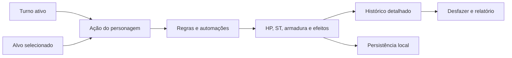

<div align="center">


# ⚔️ The Witcher Combat Tracker

### Gerencie combates complexos sem interromper o ritmo da mesa

Uma central de combate **mobile first**, instalável e preparada para funcionar offline. Controle turnos, dano localizado, armaduras, condições, magias, itens, fichas, histórico e automações inspiradas em **The Witcher TRPG** em uma única interface.

[](./manifest.json)


[**Abrir aplicação**](https://juanmeissner.github.io/The-Wticher-Combat-Tracker/) · [**Ver repositório**](https://github.com/juanmeissner/The-Wticher-Combat-Tracker) · [**Guia rápido**](#-guia-rápido-de-uso)

</div>

---

## Visão geral

O **The Witcher Combat Tracker** foi criado para reduzir cálculos repetitivos e manter todas as informações importantes visíveis durante uma sessão de RPG. A aplicação separa claramente duas responsabilidades:

- **personagem do turno ativo:** é quem está agindo e pagando custos de EST;
- **alvo selecionado:** é quem recebe dano, cura, condições, itens ou magias.

Essa separação permite executar ações rapidamente sem perder o contexto do combate. Cada alteração relevante pode alimentar o histórico, o sistema de desfazer, os relatórios e as fichas persistentes.

O equipamento também acompanha esse contexto: cada participante possui seu próprio inventário, suas próprias habilidades e sua própria configuração de Magia Expandida. Ao avançar o turno, as abas **Itens** e **Habilidades** mudam automaticamente para as coleções do novo personagem ativo.



## Prévia da interface

### 📱 Experiência mobile / iOS

<p align="center">
  
</p>

<p align="center"><sub>Interface mobile first com navegação compacta, cartões legíveis e pad integrado à área inferior do iOS.</sub></p>

### 🖥️ Experiência desktop

<p align="center">
  
</p>

<p align="center"><sub>Visão expandida para acompanhar vários participantes, condições e recursos sem perder os controles principais.</sub></p>

## Destaques do produto

| Sistema | O que entrega |
|---|---|
| ⚔️ Combate | Iniciativa, turnos, rodadas, alvos, HP, ST, armadura, dano localizado e testes de morte |
| 🧙 Fichas | Personagens reutilizáveis com recursos atuais, inventário, habilidades, raça, defesa adicional e equipamentos |
| 👹 Bestiário | Monstros predefinidos, busca, detalhes e painéis rápidos de ataques, habilidades e perícias |
| 🌀 Condições | Painel responsivo em grade, duração, stacks e dano recorrente automatizado |
| ✨ Efeitos | Magias e itens ativos vinculados individualmente aos participantes |
| 🎒 Inventário | Itens individuais por personagem, troca pelo turno ativo, catálogo, quantidades, filtros e detalhes |
| ⚒️ Criação e alquimia | Receitas funcionais, ingredientes disponíveis/ausentes, lotes, testes e produção automática |
| 🛡️ Equipamentos | Uma arma ativa, duas reservas, cinco slots de proteção, escudo global, troca rápida e defesa persistente |
| 📚 Habilidades | Magias individuais por personagem, Magia Expandida, custo de treino, ativação e exportação |
| 📜 Histórico | Linha do tempo por rodada, filtros, autoria, alvo, cálculos e golpes finais |
| ↶ Segurança | Confirmações, desfazer ações, encontros salvos e backup completo em JSON |
| 📲 PWA | Instalação, modo standalone, cache offline, atualização e reparo do aplicativo |

## Sistemas da aplicação

### ⚔️ Gerenciamento de combate

- criação de jogadores e monstros personalizados;
- inclusão de criaturas diretamente do bestiário;
- definição de nome, iniciativa, HP, ST, CA, ataque e raça/categoria;
- defesa adicional opcional para **cabeça, tronco, braços e pernas**, independente dos equipamentos;
- ordenação por iniciativa e avanço automático de turnos e rodadas;
- indicação visual do turno atual e do próximo participante;
- nome do personagem ativo sempre sincronizado no pad;
- seleção independente do alvo da ação;
- participantes eliminados agrupados abaixo de todos os participantes vivos;
- controle de sucessos, falhas, estabilização e morte para personagens em 0 HP;
- rolagem rápida de iniciativa dos monstros ao manter pressionado o botão correspondente;
- finalização segura do combate e geração de relatório pós-combate.

### 🎯 Dano localizado e armadura

O valor digitado no pad é tratado como dano base. A aplicação calcula toda a proteção disponível na região, reduz esse total do golpe e somente depois aplica os multiplicadores escolhidos.

```text
Defesa total da região = defesa adicional da ficha + armadura equipada + escudo físico
```

As três fontes são independentes. Equipar uma peça não altera os valores preenchidos na ficha; desequipá-la remove imediatamente apenas a contribuição daquela peça. A defesa adicional e o escudo permanecem ativos enquanto continuarem configurados.

| Região | Multiplicador |
|---|---:|
| Cabeça | ×3 |
| Tronco | ×1 |
| Braço | ×0,5 |
| Perna | ×0,5 |

Também estão disponíveis:

- dano cheio, dividido ou dobrado;
- dano que ignora armadura;
- dano direto à armadura equipada, à defesa adicional ou ao escudo;
- escolha exata da fonte atingida quando **Dano Armadura** encontra mais de uma proteção disponível;
- escudos físicos somados à defesa de cabeça, tronco, braços e pernas;
- soma automática das proteções antes de decidir se o dano alcança os PV;
- registro do dano base, defesa adicional, equipamento, escudo, total absorvido, multiplicadores e PV final;
- absorção por escudo mágico e PV temporários;
- identificação automática de golpes que derrotaram o alvo.

> **Exemplo:** um personagem com 2 de defesa adicional, armadura de tronco 5 e escudo 3 possui 10 de defesa total no tronco. Um ataque de 15 deixa 5 pontos de dano. Ao desequipar a armadura, a defesa do tronco passa imediatamente para 5, mantendo apenas a defesa adicional e o escudo.

### 🛡️ Escudo mágico e PV temporários

Os dois recursos possuem comportamentos diferentes:

- **Quen e Quen Ampliado** criam escudo mágico. O dano vai diretamente ao escudo, ignora armadura e o excesso do golpe é descartado;
- quando o escudo absorve todo o ataque, não é necessário escolher local do dano;
- **Lua Cheia, Bravura de Freya e outros bônus de PV temporários** podem coexistir e são somados;
- PV temporários continuam usando localização e armadura, pois representam vida adicional e não uma barreira mágica.

### 🌀 Condições e efeitos

O seletor de condições usa um painel central responsivo em grade no celular e no desktop. Os nomes permanecem visíveis e os botões são adequados para toque ou mouse.

Cada condição ou efeito pode conter:

- duração em rodadas ou permanência;
- stacks individuais;
- descrição completa;
- origem e alvo;
- atualização, aplicação e remoção registradas no histórico;
- identidade visual e ícone próprios.

**Sangramento**, **Em Chamas** e **Envenenado** causam 1d6 por stack no início do turno afetado. As três condições aceitam até 10 stacks, conforme suas regras cadastradas.

### 🤖 Automações de regras

As automações preservam a decisão do mestre: magias e itens perguntam resultados por padrão, enquanto condições negativas usam rolagem automática. Esse comportamento pode ser alterado em **⋯ → Preferências**.

| Regra automatizada | Comportamento |
|---|---|
| Quen | Pergunta o EST gasto, debita do personagem do turno e cria 5 pontos de escudo por EST |
| Quen Ampliado | Debita o conjurador ativo e cria 10 pontos de escudo por EST |
| Yrden | Usa EST variável, calcula penalidade e controla duração |
| Axii | Pergunta o EST, calcula a penalidade do teste e aplica a condição vinculada ao alvo |
| Axii Marionete | Usa o EST gasto como custo e duração do controle |
| Sangramento, Chamas e Veneno | Rola 1d6 por stack e aplica o dano no turno do alvo |
| Pó de Coagulação | Impede que Sangramento produza efeito enquanto estiver ativo |
| Lua Cheia | Concede 10 + 1d20 PV temporários |
| Andorinha | Recupera vida por turno enquanto as condições do item forem atendidas |
| Coruja-do-mato | Recupera ST por turno |
| Filtro de Petri | Registra o bônus para o próximo sinal |
| Sangue Negro | Causa 1d6 ao vampiro que atacar o usuário protegido |
| Óleos | Adicionam o bônus contra a categoria correta de criatura |
| Fissstech | Reduz pela metade o dano recebido enquanto estiver ativo |

Criaturas predefinidas recebem suas categorias automaticamente. Monstros vampíricos entram no combate com a condição **Vampiro**, permitindo que Sangue Negro funcione sem perguntas repetidas. Personagens e criaturas personalizadas também podem receber uma raça/categoria ao serem criados.

### 👤 Inventários e habilidades por personagem

O turno ativo funciona como contexto padrão das abas **Itens** e **Habilidades**:

- cada participante mantém seu próprio inventário, habilidades e valor de Magia Expandida;
- avançar o turno troca automaticamente as duas abas para o novo personagem ativo;
- um seletor permite consultar ou editar diretamente as coleções de qualquer participante sem alterar o turno;
- ao entrar novamente em uma dessas abas, o personagem do turno volta a ser selecionado por padrão;
- o painel de aplicação de efeitos mostra somente itens e habilidades realmente possuídos pelo personagem ativo;
- fichas salvas, encontros, desfazer, backups e restaurações preservam essas coleções individualmente;
- inventários antigos compartilhados são migrados com segurança para o participante ativo.

> **Exemplo:** Geralt pode carregar uma Espada de Prata de Bruxo e Quen, enquanto Yennefer mantém Clorofórmio e suas próprias magias. Alternar o turno alterna o conteúdo exibido sem misturar os dois personagens.

### 🎒 Inventário e itens

- separação entre **Usáveis**, **Equipamentos**, **Diversos** e **Criação**;
- inclusão de itens a partir do catálogo;
- busca por nome e filtro por tipo;
- alteração de quantidade pelos botões `+` e `−`;
- uso direto de consumíveis;
- detalhes acessíveis por botão no desktop, duplo clique ou toque prolongado;
- efeitos de itens aplicáveis a qualquer participante selecionado;
- feedback visual para inclusão, remoção e uso;
- transferência de itens, materiais, moedas e equipamentos excedentes entre personagens;
- proteção contra consumo ou transferência acidental da última unidade equipada;
- catálogo validado para impedir identificadores duplicados entre armas, equipamentos e materiais;
- sincronização individual com o participante e sua ficha vinculada.

### ⚒️ Criação e alquimia

A categoria **Criação** transforma as receitas do catálogo em uma oficina vinculada ao inventário do personagem consultado:

- lista todas as receitas conhecidas e permite busca por produto;
- ao tocar no contador, abre um filtro compacto por **Armas**, **Armaduras**, **Alquimia** ou **Materiais**;
- filtro **Posso criar** mostra somente receitas com ingredientes suficientes;
- cada cartão informa os componentes livres, os ausentes e o rendimento de cada lote;
- escolha da quantidade de lotes antes de confirmar a produção;
- consumo automático dos ingredientes e inclusão do produto no inventário correto;
- rendimentos especiais preservados, como 10 flechas ou 6 unidades de Pó de Prata por lote;
- teste manual ou automático quando a receita possuir ND/CD;
- modo automático configurável em `⋯ → Preferências → Rolagens → Criação e alquimia`, usando `1d10 + bônus`;
- sucesso e falha registrados no histórico com produto, quantidade, ingredientes e resultado do teste;
- ingredientes preservados em caso de falha, evitando perdas não previstas por uma regra cadastrada;
- itens equipados ficam reservados e não são consumidos como matéria-prima.

O catálogo foi normalizado com todos os ingredientes nomeados pelas receitas. Fissstech permanece indisponível porque sua receita original contém apenas ingredientes desconhecidos (`?`). A auditoria completa está em [`docs/crafting-catalog-audit.md`](docs/crafting-catalog-audit.md).

### 🛡️ Equipamentos realmente equipáveis

Cada participante possui um conjunto de equipamentos próprio e persistente:

- uma **arma ativa** e até **duas armas reservas**;
- troca rápida da arma ativa pelo botão `🔄` no cartão do participante;
- armaduras equipadas separadamente em **cabeça, tronco, braços e pernas**;
- um escudo físico que acrescenta sua defesa às quatro regiões;
- slots explícitos `head`, `body`, `arms`, `legs` e `shield`, impedindo que calças ou braceiras substituam a proteção de tronco;
- defesa total formada pela soma da defesa adicional da ficha, da peça regional e do escudo;
- equipar ou desequipar uma peça atualiza imediatamente a defesa efetiva sem modificar a defesa adicional;
- defesa atual de cada peça preservada quando ela é danificada, guardada, salva em ficha ou restaurada em um encontro;
- reparo completo de armaduras e escudos diretamente nos detalhes do item, restaurando a defesa máxima e registrando a ação no histórico;
- identificação persistente de **arma ativa**, **reserva**, **peça equipada** e respectivo slot nos cartões do inventário;
- estado equipado preservado ao trocar de aba, mudar o personagem consultado ou avançar o turno;
- armas de duas mãos incompatíveis com um escudo ativo — o aplicativo orienta a guardar o escudo antes da troca;
- painel próprio recolhível abaixo do personagem, mantendo visível somente a arma ativa e um resumo compacto das proteções;
- histórico e ação de desfazer para equipar, desequipar, trocar armas e danificar proteções.

A rolagem de dano continua **manual por padrão**, respeitando os dados físicos da mesa. Em `⋯ → Preferências → Rolagens`, a opção **Armas e ataques** pode ser alterada para automática; nesse modo, tocar em `🎲` rola a expressão da arma e coloca o total no pad, sem causar dano imediatamente.

> **Exemplo:** uma defesa adicional de tronco 2, uma armadura equipada com 5 e um escudo com 3 fornecem 10 de proteção. Se **Dano Armadura** for escolhido, o mestre decide se o desgaste será aplicado à defesa adicional, à armadura ou ao escudo.

### ✨ Habilidades, sinais e magias

- catálogo com busca e filtro por tipo ou elemento cadastrado;
- detalhes de profissão, categoria, duração, defesa, dano, consumo, alcance e ação;
- adição, remoção, ativação e desativação;
- cálculo do custo total de treino;
- modificador de **Magia Expandida** persistente;
- efeitos aplicáveis no combate com indicação de **conjurador → alvo**;
- exportação das habilidades para uma planilha `.xlsx` no desktop;
- sincronização individual com o participante e sua ficha vinculada.

### 🧙 Fichas persistentes

Em **⋯ → Fichas**, é possível criar personagens reutilizáveis contendo:

- nome, HP máximo, ST máximo e CA;
- HP e ST atuais preservados entre combates;
- raça ou categoria da criatura;
- ataque e dano;
- defesa adicional opcional da cabeça, tronco, braços e pernas;
- inventário individual;
- habilidades individuais;
- arma ativa, reservas, armaduras e escudo equipados, incluindo a defesa restante de cada peça.

Uma ficha pode ser ativada para consultar seu inventário e suas habilidades ou adicionada diretamente ao combate. Alterações feitas durante a sessão são sincronizadas para reutilização posterior, sem substituir as coleções dos outros participantes.

### 👹 Bestiário e biblioteca personalizada

O bestiário oferece busca, ficha detalhada e adição rápida de monstros predefinidos. Durante o combate, cada criatura pode apresentar três painéis independentes abaixo do cartão principal:

- **Ataques:** mostra dano, efeitos associados e permite consultar ou rolar a expressão cadastrada;
- **Habilidades:** exibe o nome e a descrição completa de cada característica especial;
- **Perícias:** organiza os testes e seus respectivos bônus em uma grade compacta.

Os painéis de **Habilidades** e **Perícias** começam recolhidos para não poluir a tela e podem ser abertos separadamente quando a informação for necessária. Seus dados são copiados para o participante e preservados em encontros e backups. Os ataques continuam usando a mesma preferência de rolagem das armas e permanecem exclusivos dos monstros.

Para conteúdo próprio, **⋯ → Biblioteca** permite criar, editar e excluir:

- itens personalizados, incluindo armas, armaduras, escudos, dano, defesa, quantidade de mãos e slot corporal;
- habilidades personalizadas;
- monstros personalizados com vários ataques, informados um por linha.

O conteúdo original permanece intacto e a biblioteca pessoal é mantida somente no dispositivo do usuário.

### 📜 Histórico inteligente

O histórico funciona como uma linha do tempo auditável do combate:

- organização por rodada;
- filtros por dano, cura, efeito, condição e turno;
- filtro por participante;
- identificação de autor e alvo, como `Geralt → Grifo`;
- nomes, ícones e dano específico para Sangramento, Chamas e Veneno;
- registro de local atingido, rolagem, armadura, escudos, PV temporários e EST;
- detalhes de efeitos aplicados, atualizados, removidos ou expirados;
- registro próprio para criação, falha de fabricação e transferência entre participantes;
- substituição de “dano” por **“derrotou”** quando a ação elimina o alvo;
- cartões compactos no mobile e detalhes expandidos sob demanda.

### 💾 Sessão, segurança e manutenção

O menu **⋯** concentra as ferramentas administrativas:

- `↶` desfaz ações recentes;
- salva e carrega encontros completos;
- exporta e restaura backup em JSON;
- gera relatório pós-combate com rodadas, participantes, derrotas, dano e cura;
- configura contraste, animações e modos de rolagem;
- instala ou atualiza a PWA;
- repara o cache sem apagar os dados do usuário;
- restaura preferências;
- permite apagar todos os dados com dupla confirmação.

## 🎮 Guia rápido de uso

### 1. Prepare os participantes

1. Abra **⚔️ Combate**.
2. Toque em `🧙‍♂️` para criar um jogador ou em `👹` para criar/escolher um monstro.
3. Se preferir um personagem reutilizável, abra `⋯ → Fichas → Nova ficha`.
4. Informe os recursos e, se desejar, uma defesa adicional por região. Depois, use **+ Combate**.

### 2. Entenda turno e alvo

- o nome acima do teclado numérico indica **quem está no turno**;
- o cartão destacado indica **quem está selecionado como alvo**;
- use `⏩` para avançar ao próximo participante;
- magias automatizadas com custo variável descontam EST do personagem do turno, mas afetam o alvo selecionado.

### 3. Prepare os itens e as habilidades do personagem

1. Verifique o nome do personagem indicado como turno ativo.
2. Abra **🎒 Itens** e adicione somente os objetos carregados por ele.
3. Selecione uma arma ou proteção e use **Equipar**. A primeira arma será ativa; as duas seguintes ficarão nas reservas. Cabeça, tronco, braços, pernas e escudo podem ser equipados simultaneamente.
4. Abra **✨ Habilidades** e adicione seus sinais, magias ou técnicas.
5. Use o seletor no alto da aba para consultar outro participante sem avançar o combate.
6. Ao usar `⏩`, as duas abas passarão automaticamente para as coleções do próximo personagem.
7. Para fabricar algo, abra **🎒 Itens → Criação** e consulte os componentes livres no inventário.
8. Use **Posso criar** para esconder receitas ainda incompletas, escolha **Criar** e informe o número de lotes.
9. Para reunir materiais, selecione o item e use **🔄 Transferir item**; escolha o destinatário e a quantidade.

No combate, abra ou recolha **EQUIPAMENTOS** abaixo do personagem. Use `🔄` para alternar a arma ativa e `🎲` para consultar ou rolar seu dano, conforme a preferência escolhida.

Para monstros predefinidos, abra os painéis **ATAQUES**, **HABILIDADES** ou **PERÍCIAS** abaixo da criatura. Habilidades e perícias permanecem recolhidas por padrão e não exigem abrir novamente a ficha completa do bestiário.

### 4. Aplique dano

1. Selecione o cartão do alvo.
2. Digite o dano base no teclado numérico.
3. Toque em `☠️`.
4. Escolha cabeça, tronco, braço ou perna.
5. Escolha o tipo de dano.
6. Confira a confirmação e o registro detalhado no histórico.

### 5. Cure ou gerencie recursos

1. Selecione o participante.
2. Digite o valor.
3. Use `❤️` para curar, `🔷` para gastar/recuperar ST ou `⚡` para definir iniciativa.
4. Em 0 HP, os botões de cura e dano também controlam sucessos e falhas de morte.

### 6. Aplique condições, magias e itens ativos

1. Selecione o alvo.
2. Use `🌀` para condições ou `✨` para efeitos de habilidades e itens.
3. Escolha o efeito desejado.
4. Quando necessário, informe duração, stacks, EST ou resultado de dados.
5. Avance os turnos normalmente; os efeitos recorrentes serão processados.

### 7. Consulte ou recupere a sessão

1. Abra `⋯ → Histórico` para revisar as ações.
2. Expanda um cartão para visualizar os cálculos.
3. Use `↶` para desfazer a última alteração compatível.
4. Antes de limpar dados ou trocar de dispositivo, use `⋯ → Backup JSON`.

## 🧭 Mapa dos controles

| Controle | Função |
|:---:|---|
| `🧙‍♂️` | Adicionar jogador |
| `👹` | Criar ou escolher monstro |
| `❌` | Encerrar o combate; mantenha pressionado para uma limpeza completa |
| `⏩` | Avançar turno e, quando necessário, a rodada |
| `🌀` | Abrir o painel de condições |
| `✨` | Aplicar efeitos de magias ou itens |
| `❤️` | Curar HP ou adicionar sucesso de morte |
| `☠️` | Causar dano localizado ou adicionar falha de morte |
| `🔷` | Gastar ou recuperar ST |
| `⚡` | Definir iniciativa; mantenha pressionado para rolar monstros |
| `🔄` | Alternar entre a arma ativa e as reservas do personagem |
| `⚒️ Criação` | Consultar receitas e fabricar lotes com o inventário do personagem |
| `🔄 Transferir item` | Mover uma quantidade do item selecionado para outro personagem |
| `🎲` | Consultar a expressão de dano ou rolá-la automaticamente no pad |
| `C` | Limpar o valor digitado |
| `←` | Apagar o último dígito |
| `↶` | Desfazer a última ação disponível |
| `⋯` | Abrir histórico, fichas, biblioteca, preferências, backup e manutenção |

## 📱 Mobile first, iOS e desktop

A interface foi construída para sessões presenciais e se adapta ao espaço disponível:

- navegação por toque entre **Combate**, **Itens** e **Habilidades**;
- gesto horizontal para alternar entre as três telas quando nenhum modal está aberto;
- pad fixado na parte inferior somente durante o combate;
- uso da safe area em iPhones com notch e modo standalone;
- notificações posicionadas acima do pad e dentro da área visível;
- modais centralizados, roláveis e protegidos contra sobreposição da navegação;
- painel de condições em grade tanto no mobile quanto no desktop;
- botões de detalhes e interações próprias para mouse em telas maiores;
- suporte a teclado, foco, tecla `Esc`, contraste alto e redução de animações.

### Instalação no iPhone ou iPad

1. Abra a aplicação no **Safari**.
2. Toque em **Compartilhar**.
3. Escolha **Adicionar à Tela de Início**.
4. Abra o aplicativo pelo novo ícone para usar o modo standalone.

### Atualização e reparo

Se uma versão nova não aparecer, use:

`⋯ → Aplicativo → Atualizar agora`

Se ainda houver arquivos antigos:

`⋯ → Aplicativo → Cache e dados → Reparar cache`

O reparo baixa novamente os arquivos da aplicação e preserva fichas, combate e preferências.

## 💾 Dados, privacidade e backup

Não existe conta, servidor ou banco de dados remoto. Os dados são mantidos no `localStorage` do navegador e incluem:

- combate atual;
- fichas e recursos atuais;
- inventários, habilidades, equipamentos, desgaste das proteções e Magia Expandida de cada participante;
- histórico e encontros salvos;
- biblioteca personalizada;
- preferências e modos de rolagem.

> [!IMPORTANT]
> Limpar os dados do site ou remover o armazenamento do navegador pode apagar a campanha local. Exporte periodicamente um **backup JSON completo**, principalmente antes de trocar de dispositivo.

## 🧰 Tecnologias

| Camada | Tecnologia |
|---|---|
| Estrutura | HTML5 semântico |
| Interface | CSS3, Tailwind CSS e layout responsivo próprio |
| Aplicação | JavaScript Vanilla organizado por domínio |
| Persistência | LocalStorage e backups JSON |
| PWA | Web App Manifest, Service Worker e Cache API |
| Exportação | SheetJS para arquivos Excel |
| Compatibilidade | APIs modernas de navegador, UTF-8, safe areas e modo standalone |

O projeto não exige framework JavaScript, bundler ou etapa de compilação.

## 🗂️ Organização do código

```text
.
├── index.html                    # Estrutura da aplicação e modais
├── style.css                    # Estilos principais
├── mobile.css                   # Responsividade, iOS e acessibilidade
├── character-collections.css    # Seletor e contexto das coleções individuais
├── equipment.css                # Painéis, armas, armaduras e ações dos monstros
├── crafting.css                 # Oficina, receitas, ingredientes e transferência
├── manifest.json                # Metadados da PWA
├── service-worker.js            # Entrada do Service Worker
├── .editorconfig                # Codificação UTF-8 consistente entre editores
├── .vscode/settings.json        # Configuração de UTF-8 para o VS Code
├── js/
│   ├── abilities/               # Catálogo, inventário e exportação de habilidades
│   ├── combat/                  # Turnos, dano, renderização, efeitos e persistência
│   ├── core/                    # Utilitários e notificações
│   ├── ui/                      # Componentes de interface e modais
│   ├── character-collections.js # Inventários e habilidades por participante
│   ├── equipment.js             # Equipamentos, defesas, rolagens e ataques de monstros
│   ├── crafting.js              # Receitas, testes, produção e transferência de itens
│   ├── enhancements.js          # Fichas, biblioteca, preferências e manutenção
│   ├── rules-automation.js      # Automações de magias, itens e categorias
│   └── session-features.js      # Histórico, desfazer, encontros, backup e relatório
├── tests/                        # Validação das coleções e integridade dos catálogos
├── docs/                         # Auditorias técnicas e documentação complementar
└── img/                          # Imagens do bestiário e capturas da interface
```

## 🚀 Executando localmente

Por utilizar Service Worker, a aplicação deve ser aberta por HTTP em vez de diretamente pelo arquivo `index.html`.

```bash
git clone https://github.com/juanmeissner/The-Wticher-Combat-Tracker.git
cd The-Wticher-Combat-Tracker
python -m http.server 8080
```

Depois, acesse [http://localhost:8080](http://localhost:8080).

Também é possível usar qualquer servidor estático, como **Live Server**, `npx serve` ou GitHub Pages.

### Testes de integridade

```bash
node tests/character-collections.test.cjs
node tests/items-data.test.cjs
node tests/equipment.test.cjs
node tests/crafting.test.cjs
```

Os testes verificam o isolamento entre personagens, a migração do armazenamento antigo, a sincronização com fichas, a integridade do catálogo, a classificação dos cinco slots de proteção, os três espaços de arma, a incompatibilidade entre escudo e arma de duas mãos, a soma das fontes defensivas, o desequipamento, o desgaste, o reparo das proteções, as rolagens, o catálogo de ataques, habilidades e perícias dos monstros, a resolução de ingredientes, os rendimentos das receitas, a proteção de itens equipados e a transferência entre personagens.

## ✅ Estado atual

- [x] Interface mobile first e responsiva
- [x] PWA instalável e modo offline
- [x] Compatibilidade visual com safe areas do iOS
- [x] Combate, iniciativa, rodadas e dano localizado
- [x] Fichas persistentes e encontros salvos
- [x] Inventários e habilidades individuais vinculados ao personagem do turno
- [x] Criação e alquimia por personagem, com receitas, lotes e testes configuráveis
- [x] Transferência de itens e materiais entre personagens
- [x] Arma ativa, duas reservas e troca rápida por personagem
- [x] Armaduras regionais em cinco slots, escudo global e desgaste persistente
- [x] Defesa adicional independente e soma automática de todas as proteções
- [x] Estado equipado persistente por personagem, aba, turno e ficha
- [x] Ataques de monstros em cartões próprios e recolhíveis
- [x] Habilidades e perícias de monstros em painéis rápidos recolhidos por padrão
- [x] Rolagem manual ou automática de armas e ataques
- [x] Seletor para consultar as coleções de outros participantes
- [x] Catálogo de itens validado contra identificadores duplicados
- [x] Bestiário e biblioteca própria
- [x] Condições, efeitos e automações de regras
- [x] Histórico detalhado, desfazer e relatório pós-combate
- [x] Backup completo, atualização e reparo de cache
- [ ] Sincronização opcional entre dispositivos
- [ ] Perfis de regras para outros sistemas de RPG
- [ ] Testes automatizados de interface ponta a ponta

## 🤝 Contribuições

Sugestões, correções e novas automações são bem-vindas. Ao contribuir:

1. descreva a regra ou problema com um exemplo reproduzível;
2. preserve a experiência mobile first;
3. valide o comportamento no desktop e, quando possível, no Safari/iOS;
4. evite poluir a interface com informações que podem ficar em detalhes expansíveis;
5. mantenha automações configuráveis quando a decisão depender do mestre.

## Aviso legal

Este é um projeto independente, criado por fãs para apoio a sessões de RPG de mesa. **The Witcher** e suas marcas relacionadas pertencem aos respectivos titulares. O projeto não possui afiliação oficial com CD PROJEKT RED ou R. Talsorian Games.

O repositório não possui atualmente um arquivo de licença de software específico. Consulte o autor antes de redistribuir ou reutilizar partes substanciais do código.

---

<div align="center">

**Menos tempo calculando. Mais tempo narrando.**

Feito para mestres que querem velocidade sem abrir mão dos detalhes.

</div>
